# MARLi Temperature Contours and Potential Temperature

| Flight | Temperature Contour | Potential Temperature (850 hPa) |
|--------|---------------------|--------------------------------|
| RF01 | 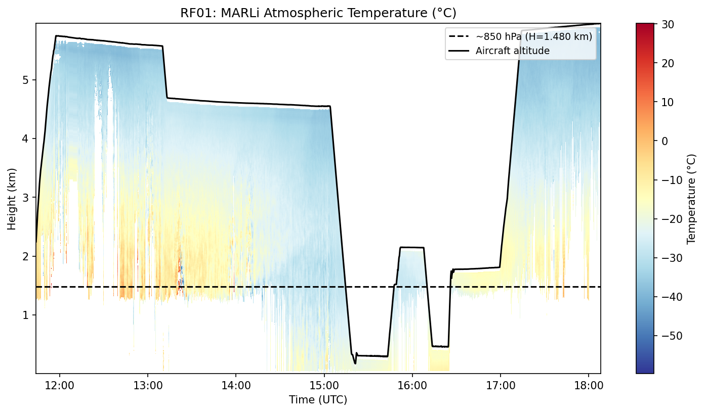 | 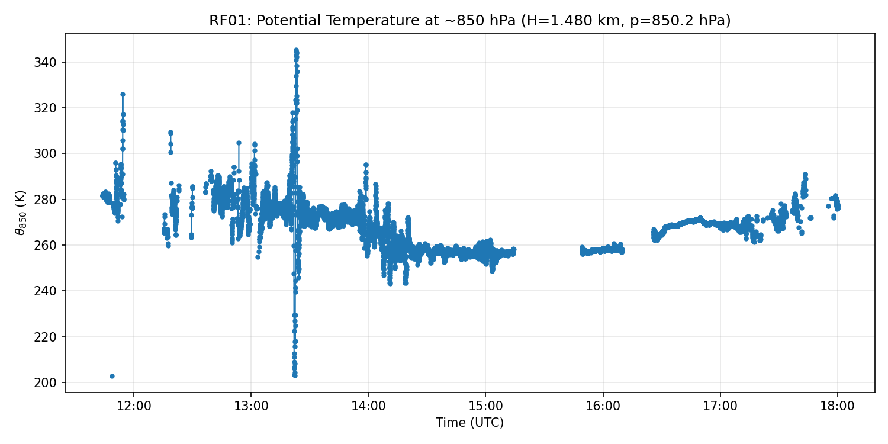 |
| RF02 | 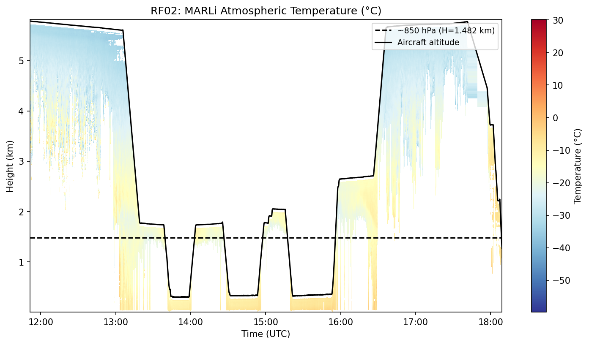 | 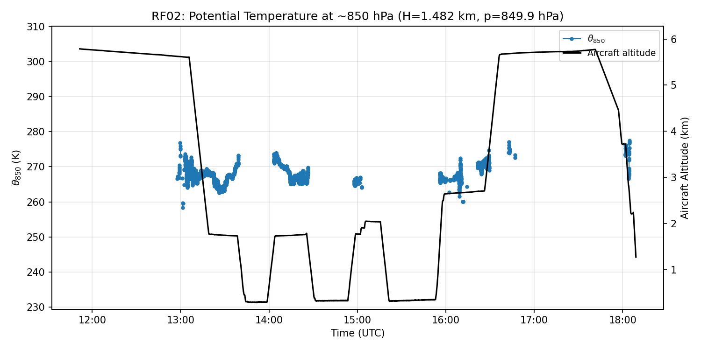 |
| RF03 | 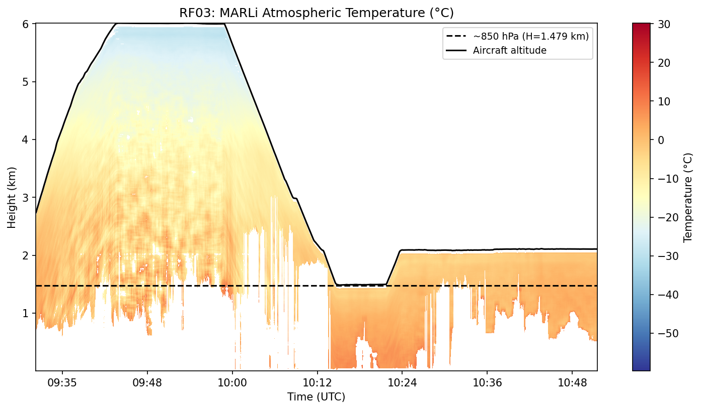 | 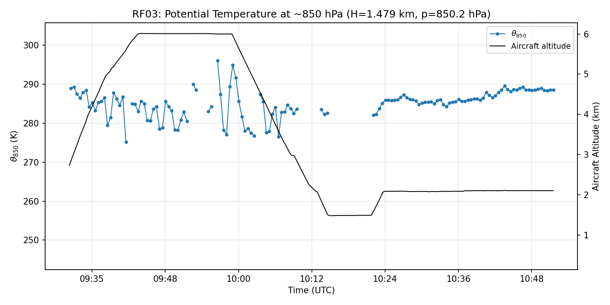 |
| RF04 | 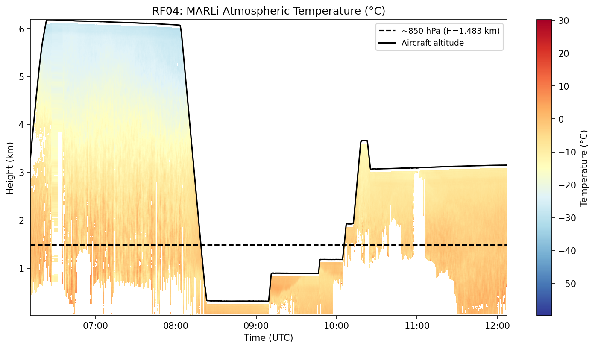 | 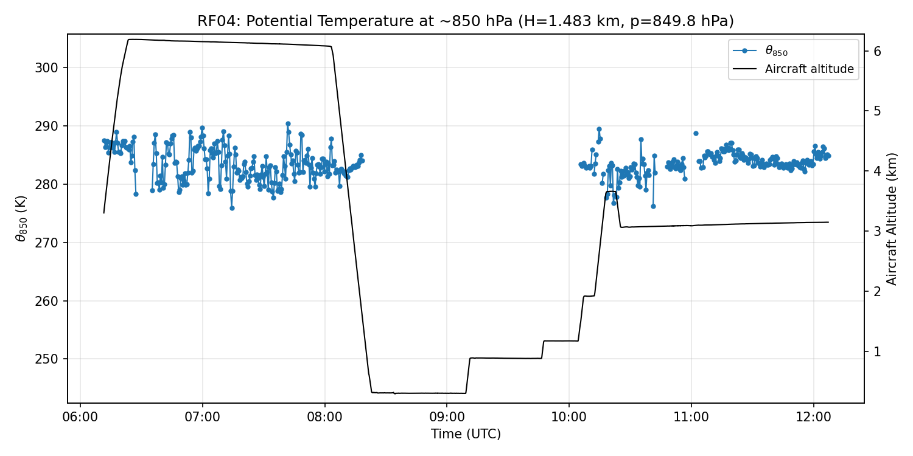 |
| RF05 | 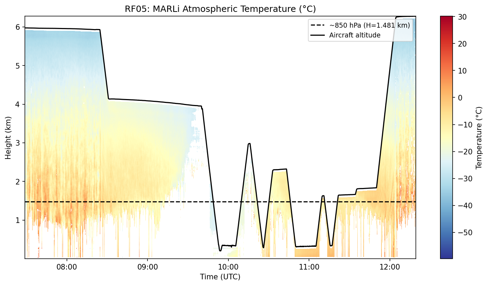 | 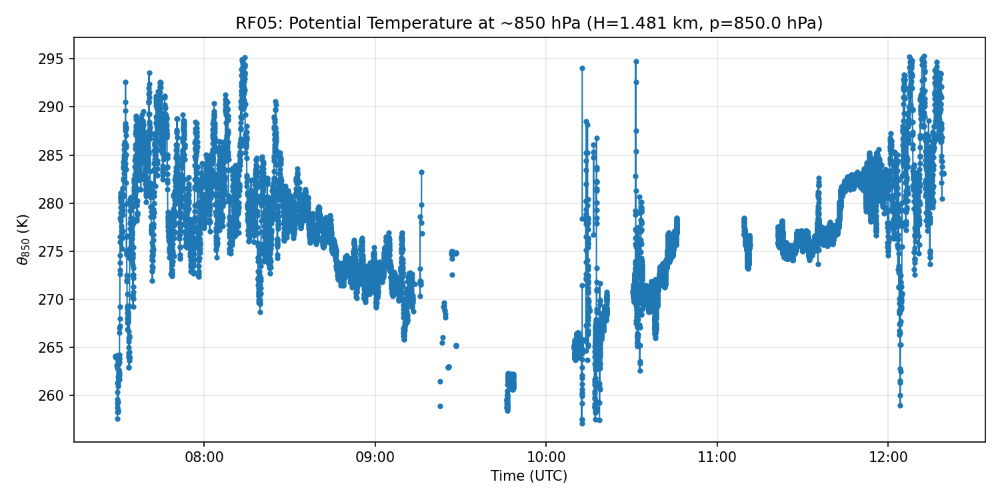 |
| RF06 | 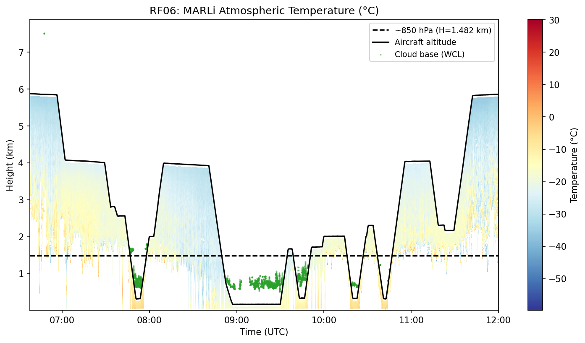 | 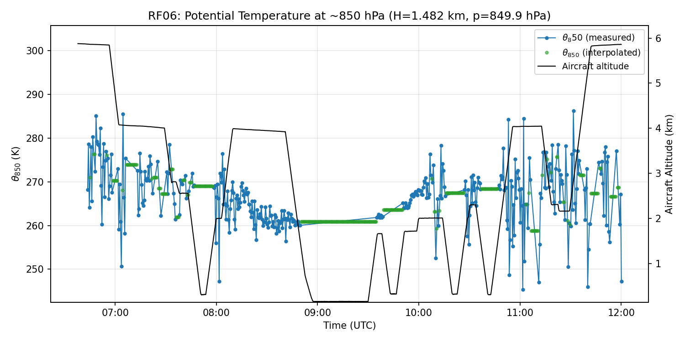 |
| RF07 | 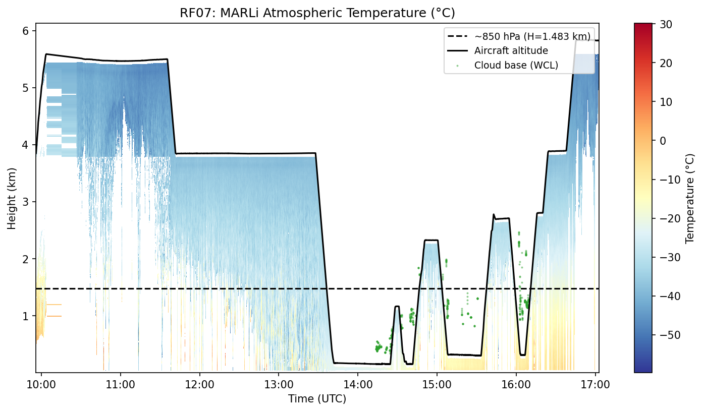 | 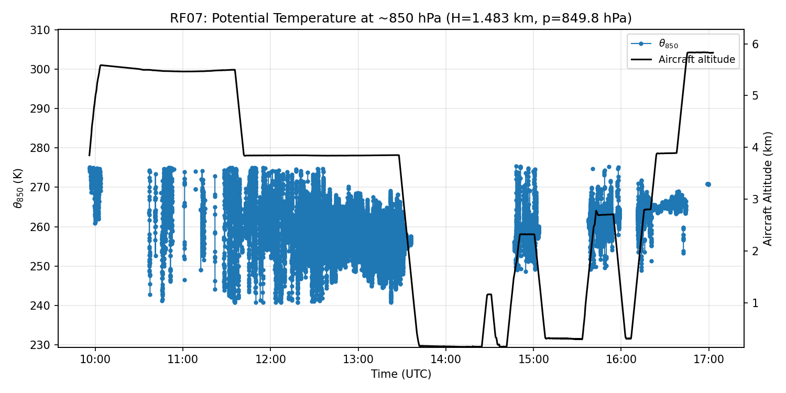 |
| RF09 | 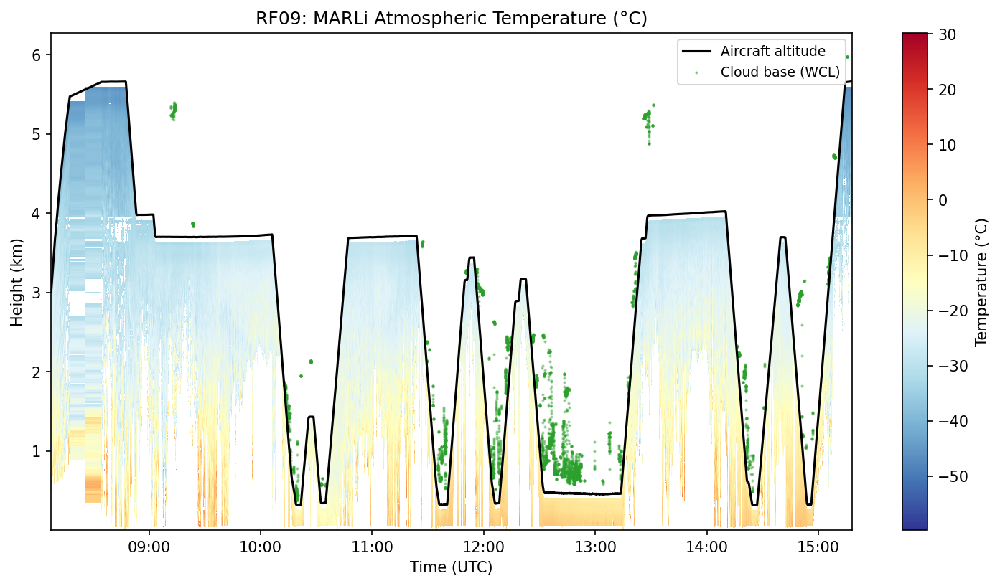 | 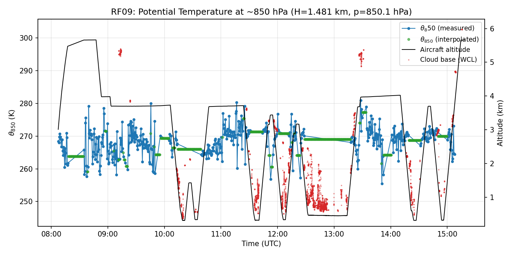 |
| RF10 | 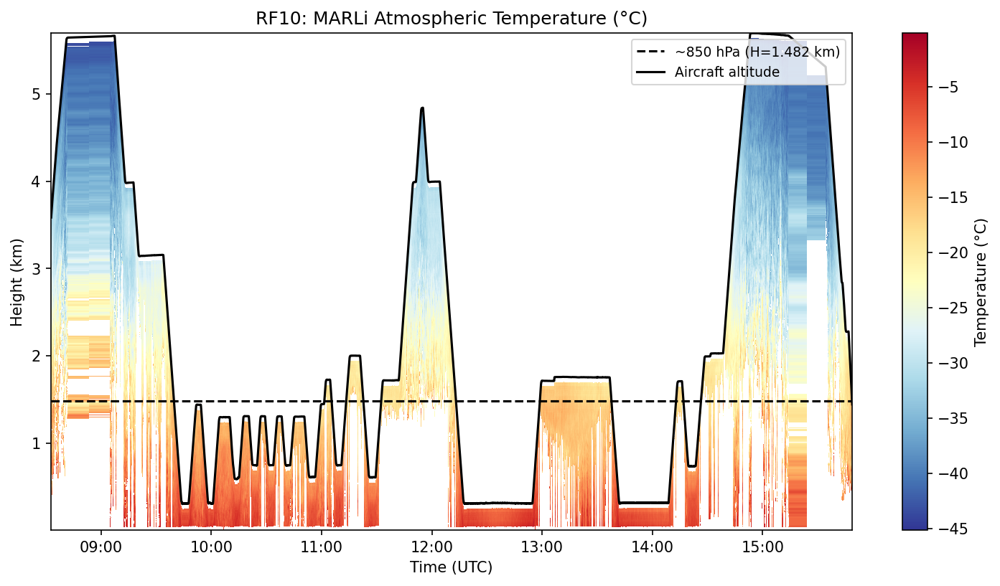 | 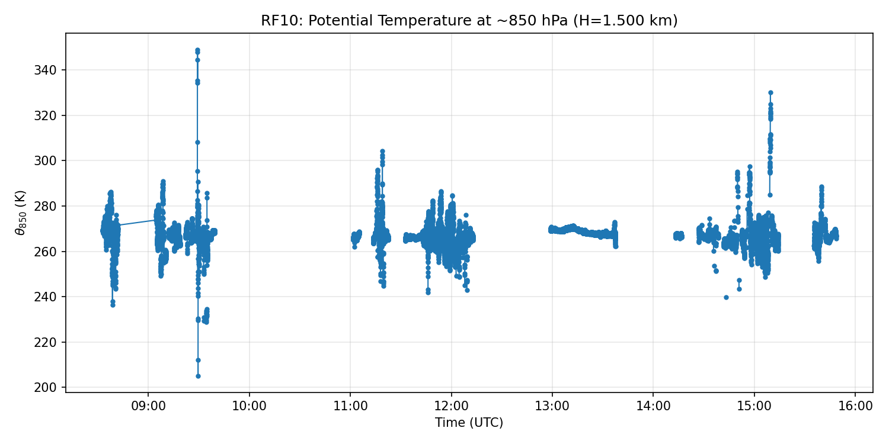 |
