# Particle Size Distributions

Note: All plots here are limited to low-level legs.

## Mean Size Distribution

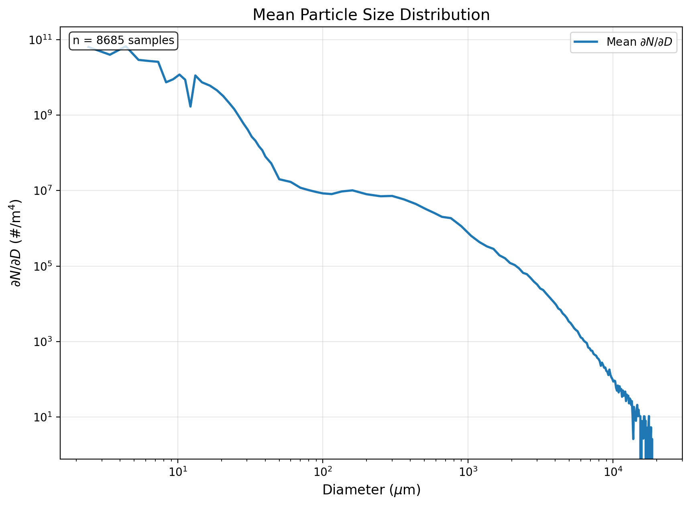

## Size Distributions Colored by Water Path

| | WVP | LWP |
|-|-----|-----|
| Scatter | 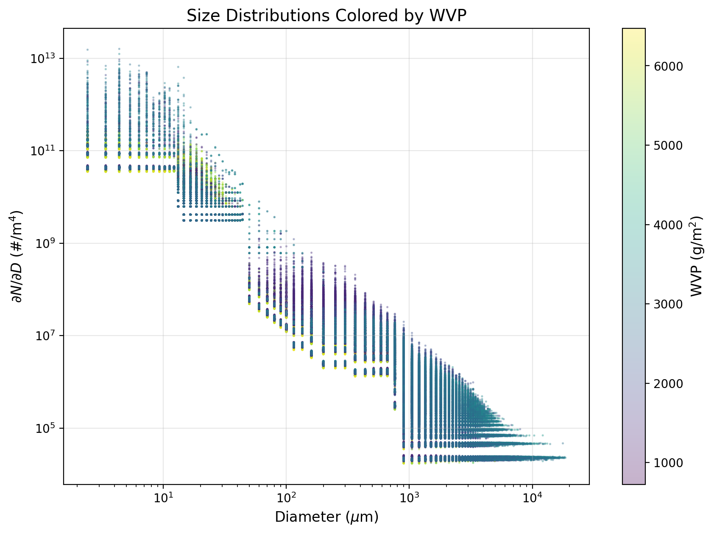 | 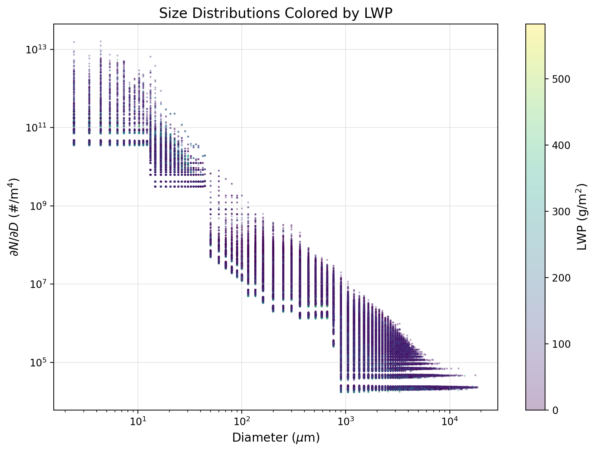 |
| Stratified | 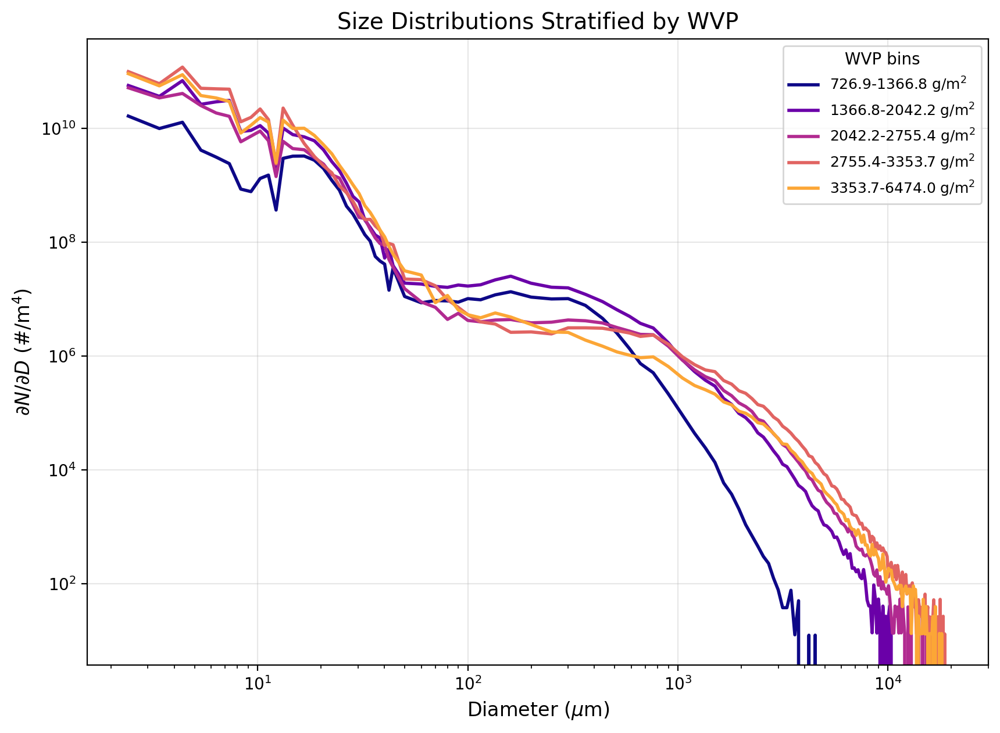 | 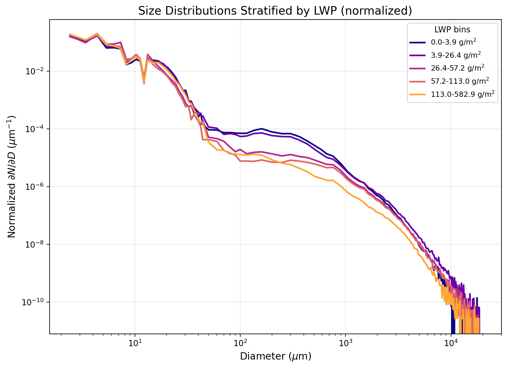 |

## Integrated Properties vs Water Path

| WVP | LWP |
|-----|-----|
| 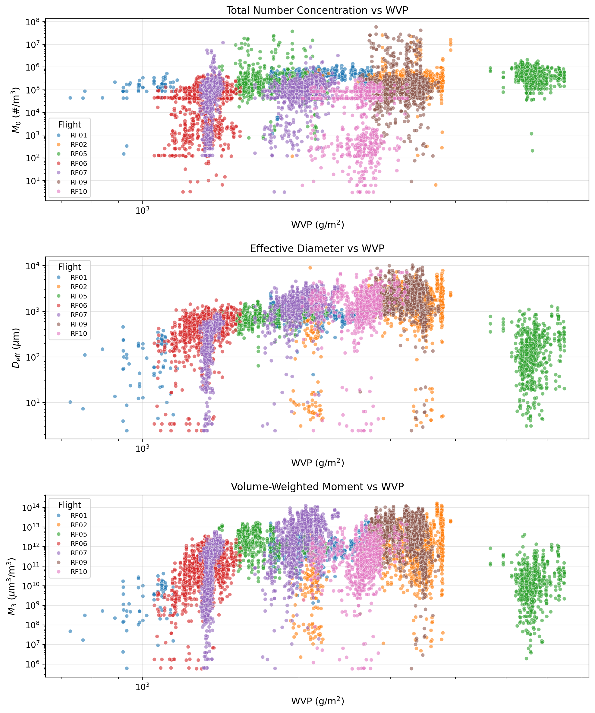 | 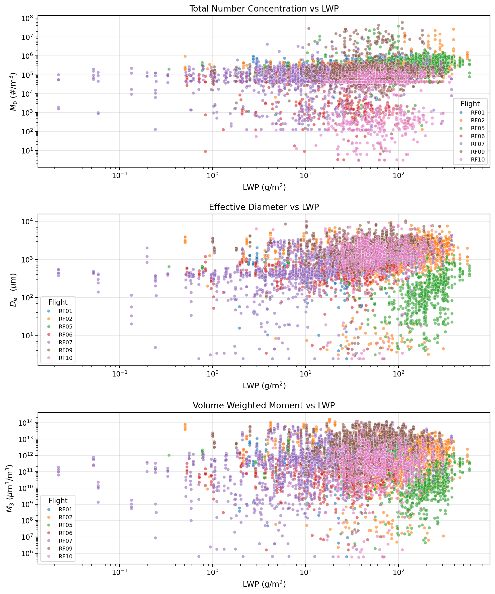 |

## dN/dD Heatmaps by Flight

| Flight | Heatmap |
|--------|---------|
| RF01 | 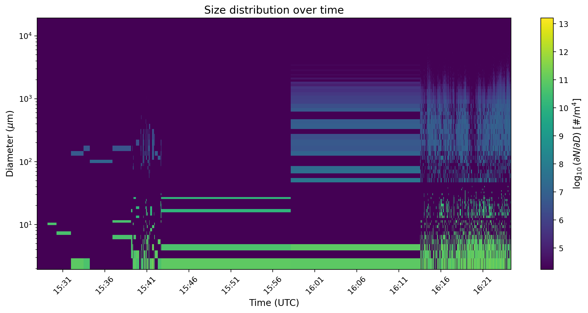 |
| RF02 | 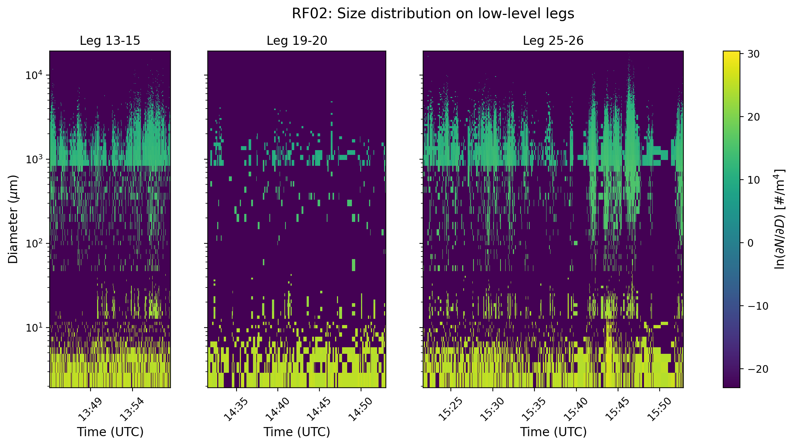 |
| RF05 | 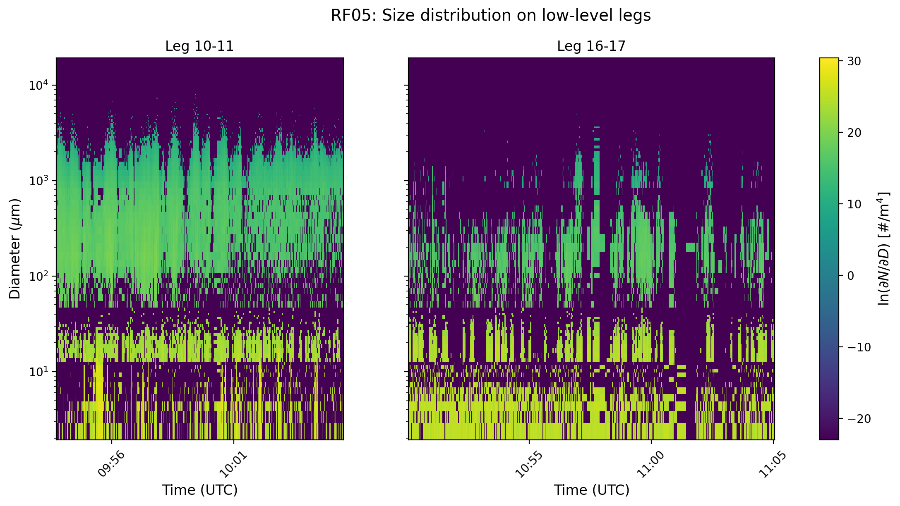 |
| RF06 | 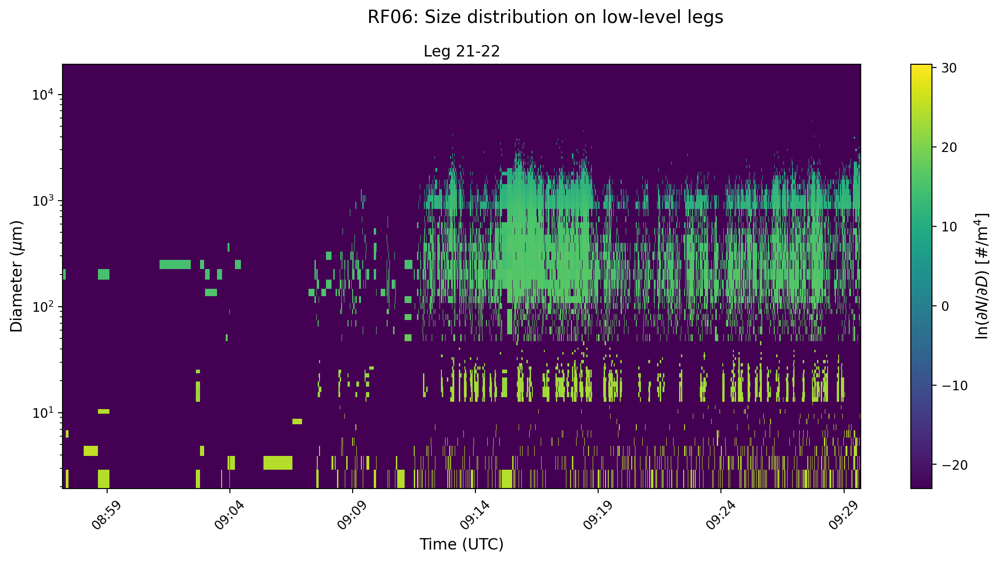 |
| RF07 | 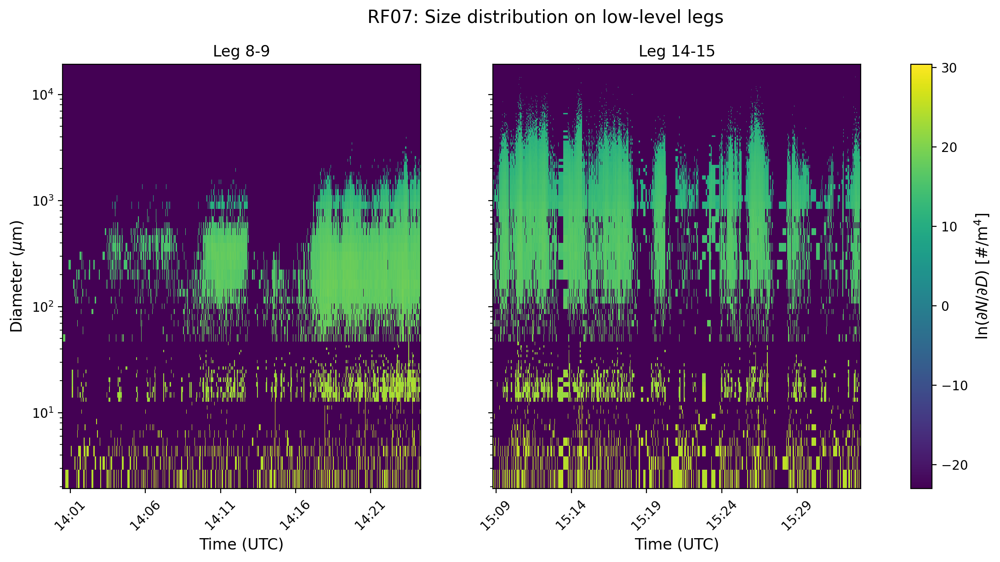 |
| RF09 | 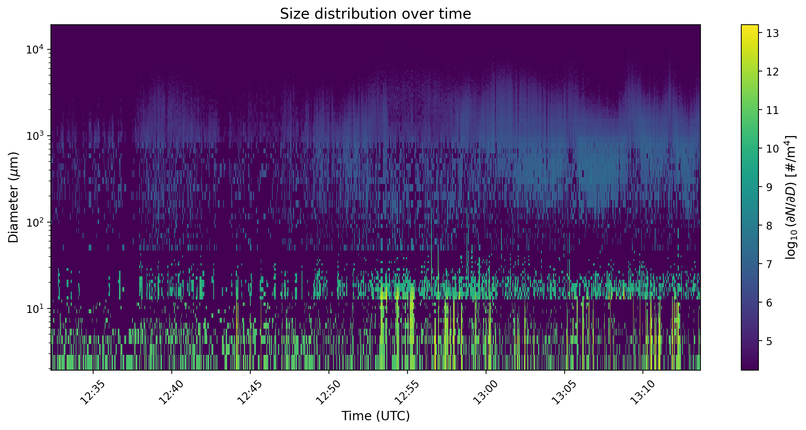 |
| RF10 | 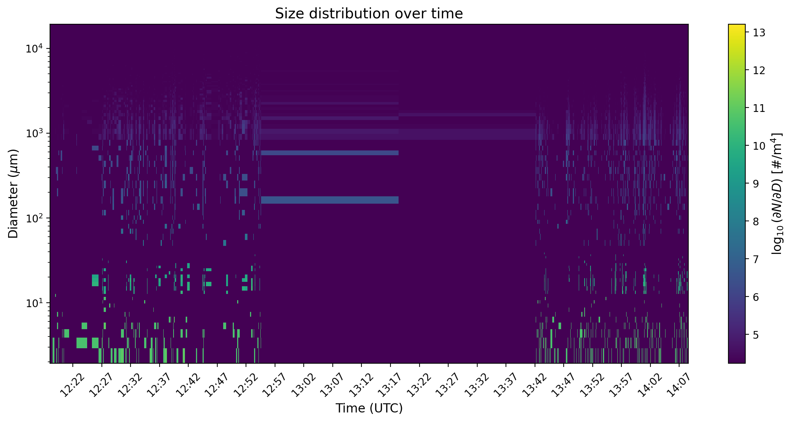 |
