# SHAP Analysis

## Beeswarm plots

Each figure shows one model across four staged predictor sets (Thermo -> +Dynamics -> +Clouds -> +Isotopes). Within each panel, features are ranked by mean |SHAP value| (most important at top). Each dot is one grid cell-month sample. The x-axis shows the SHAP value: how much that feature pushed the predicted PE above (positive) or below (negative) the model baseline. Dot color reflects the feature's value -- red = high, blue = low -- so a cluster of red dots on the right means high feature values increase PE, while red dots on the left mean high values decrease PE. The R^2 in the title is the mean out-of-sample test score across 25 random splits.

### CAM5
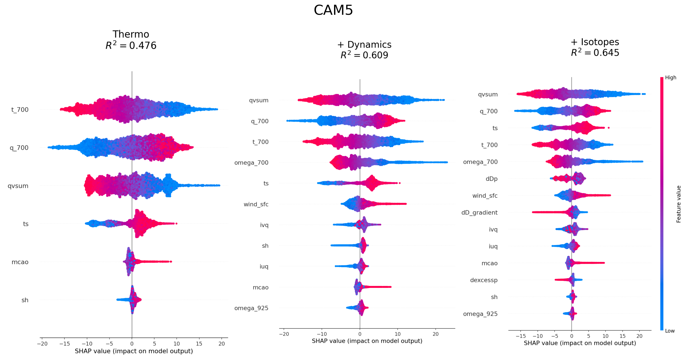

### CAM6
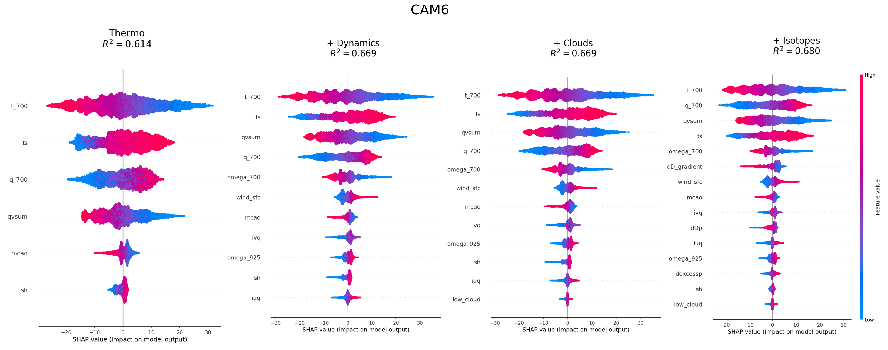

### ECHAM
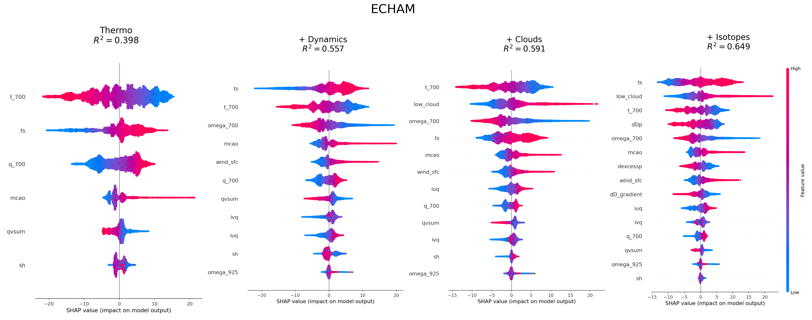

### GISS
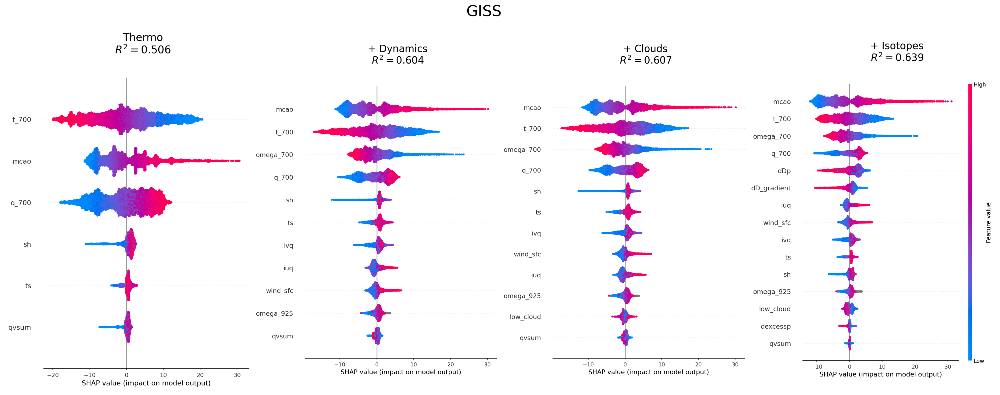

### GSM
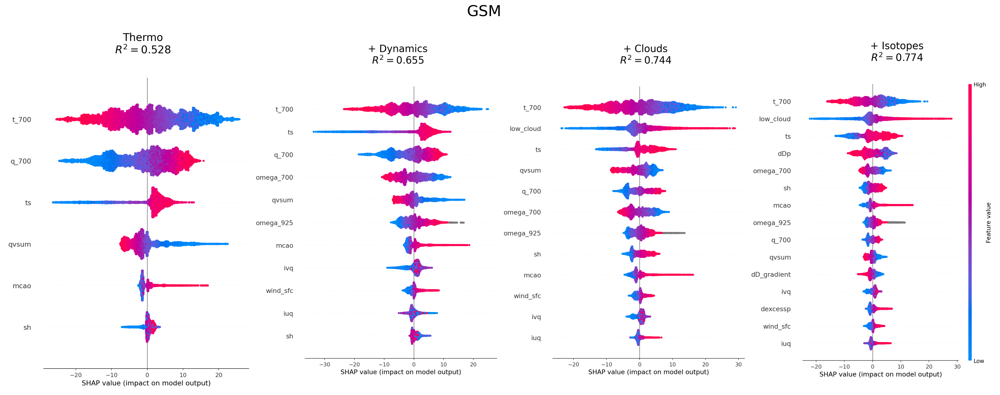

### LMDZ
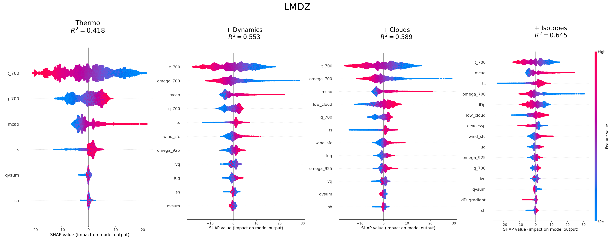

### MIROC
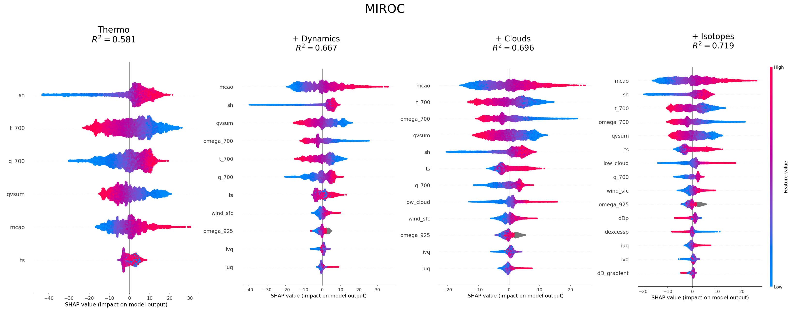

---

## Group-level PE attribution via Shapley values

Each bar shows the fraction of Stage 4 R2 attributed to each predictor group (thermodynamics, dynamics, clouds, isotopes) for one model. Attributions are computed using the group Shapley value (Shapley 1953; Jullum et al. 2021): each group's value is its average marginal R2 contribution over all 4! orderings of the groups, computed exactly by training XGBoost on each of the 2^4 = 16 possible group coalitions. Hyperparameters are tuned separately per coalition. Values are averaged over 5 random seeds; bars sum to the Stage 4 R2 by the efficiency axiom. Note that the Stage 4 R2 values here are estimated from 5 seeds and may differ slightly from the 25-seed estimates in the beeswarm plots above.

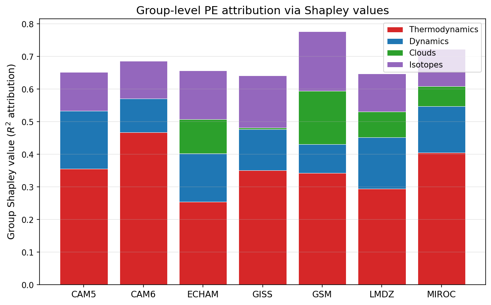

---

## Isotope-only beeswarm plots

Each figure shows SHAP values for a model trained on only the three isotope predictors (dD_gradient, dDp, dexcessp). This isolates the standalone predictive skill of isotopes. The R2 in the title is the mean out-of-sample test score across 25 random splits. Across all models, isotope-only R2 is substantially larger than the marginal gain from adding isotopes to Stage 3, indicating that most of the isotope signal is shared with thermodynamics, dynamics, and clouds.

| Model | Isotope-only | Stage 3 | Stage 4 | Isotope contribution (staged model, Stage 4 - Stage 3) |
|-------|--------------|---------|---------|--------------------------------------------------------|
| CAM5  | 0.198        | 0.607   | 0.646   | 0.039                                                  |
| CAM6  | 0.217        | 0.669   | 0.680   | 0.011                                                  |
| ECHAM | 0.252        | 0.591   | 0.649   | 0.057                                                  |
| GISS  | 0.258        | 0.607   | 0.639   | 0.032                                                  |
| GSM   | 0.332        | 0.744   | 0.774   | 0.030                                                  |
| LMDZ  | 0.207        | 0.589   | 0.645   | 0.055                                                  |
| MIROC | 0.232        | 0.696   | 0.719   | 0.023                                                  |

### CAM5
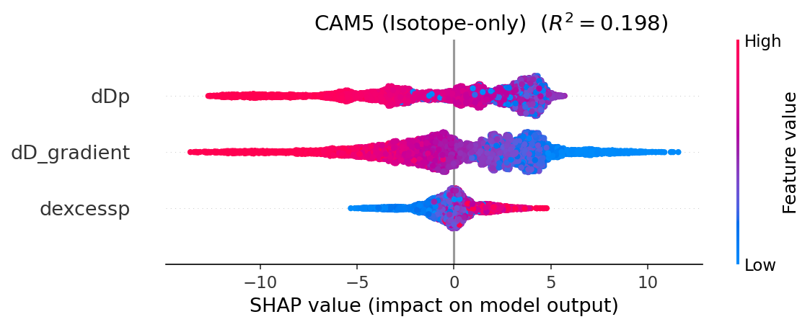

### CAM6
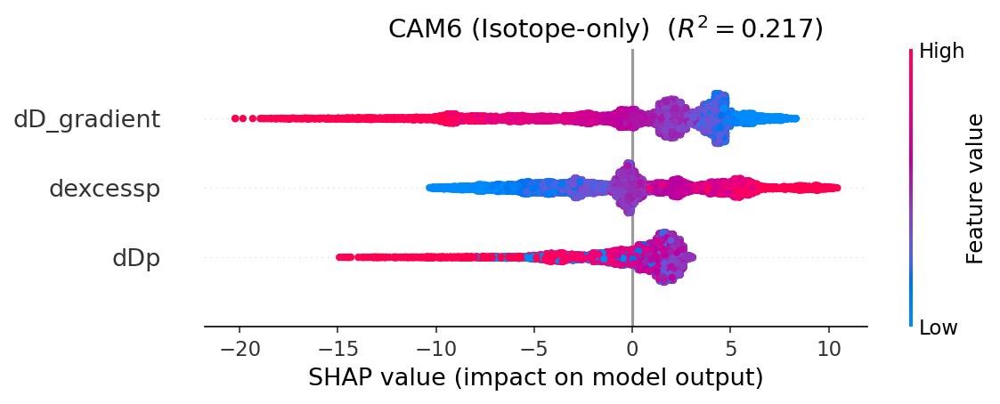

### ECHAM
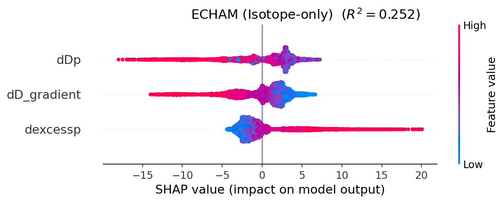

### GISS
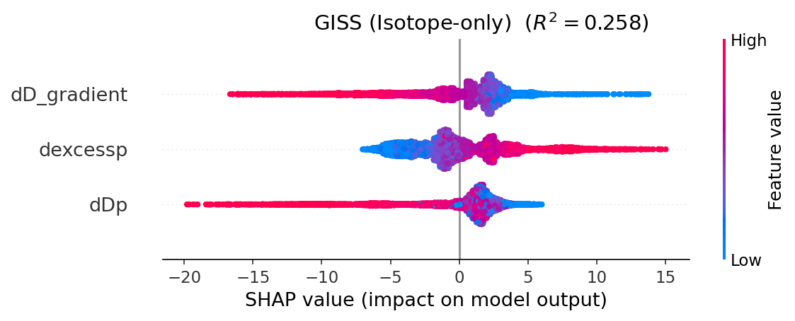

### GSM
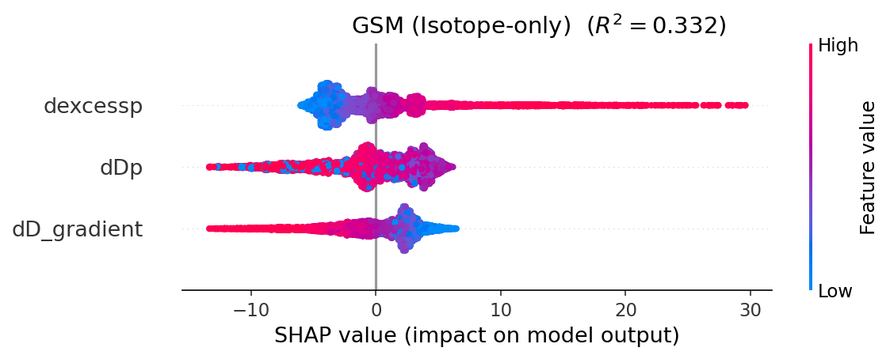

### LMDZ
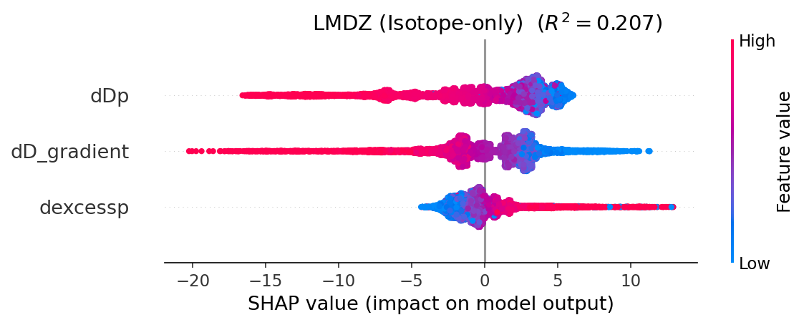

### MIROC
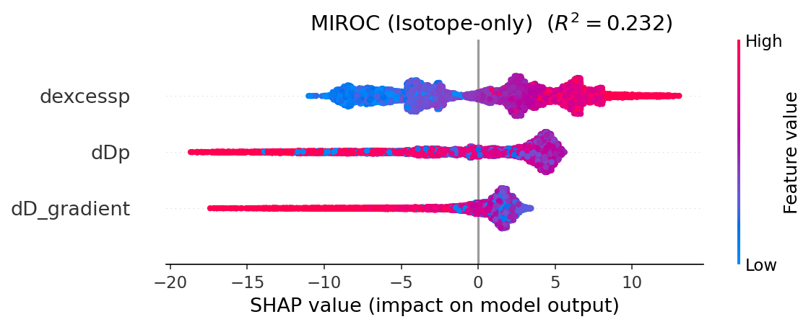

---

## Intermodel feature importance heatmap (Stage 4)

Normalized mean |SHAP| per feature across all models.

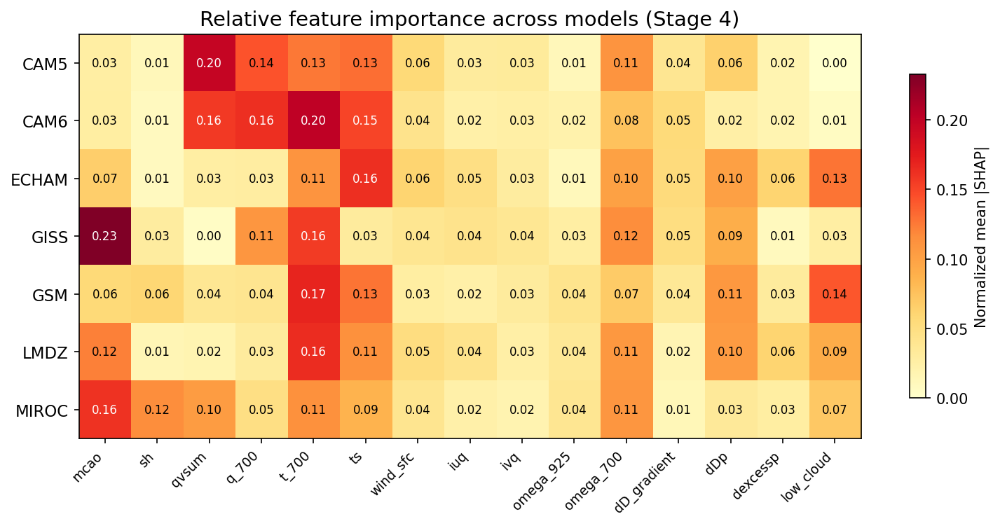

---

## MCAO SHAP dependence (colored by low cloud fraction)

Each figure shows one stage. Within each panel, the x-axis is the MCAO value and the y-axis is the SHAP value for MCAO -- i.e., how much MCAO alone shifted the predicted PE for that sample. Points above zero indicate MCAO increased PE; points below indicate it decreased PE. In Stages 3-4, dots are colored by low cloud fraction (red = high cloud, blue = low cloud), revealing how the MCAO-PE relationship is affected by cloud cover. Stages 1-2 are shown in gray since low cloud is not yet included as a predictor. Axes are shared across models within each stage to allow direct comparison.

### Stage 1: Thermo
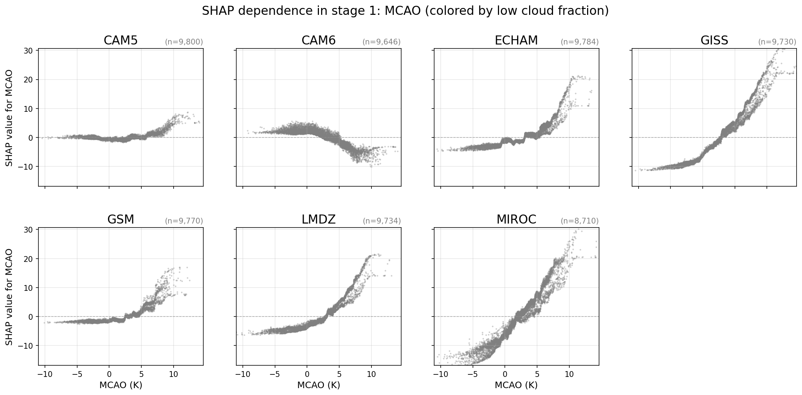

### Stage 2: + Dynamics
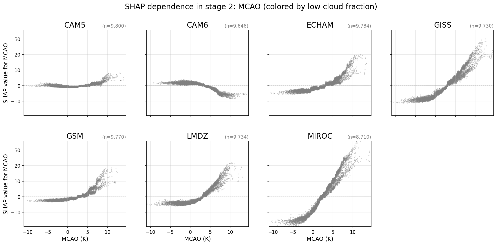

### Stage 3: + Clouds
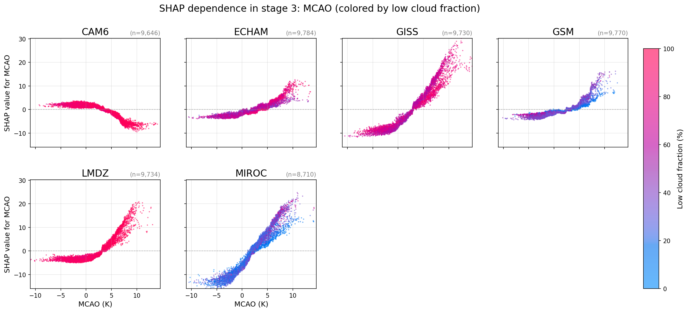

### Stage 4: + Isotopes
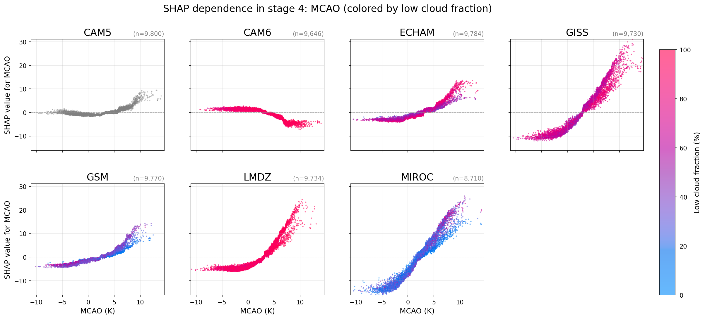
