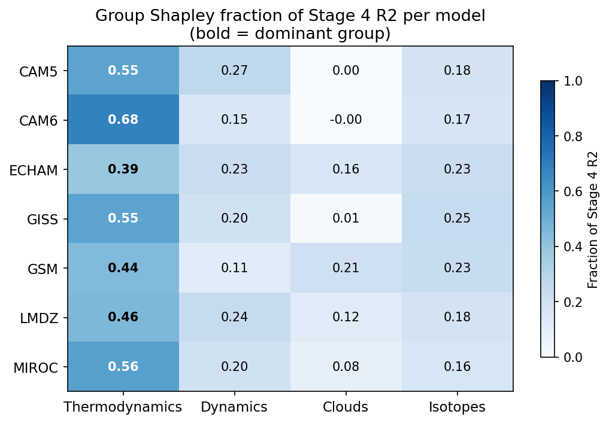
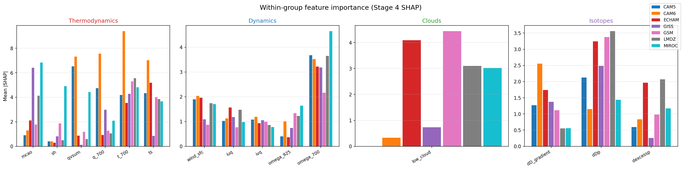
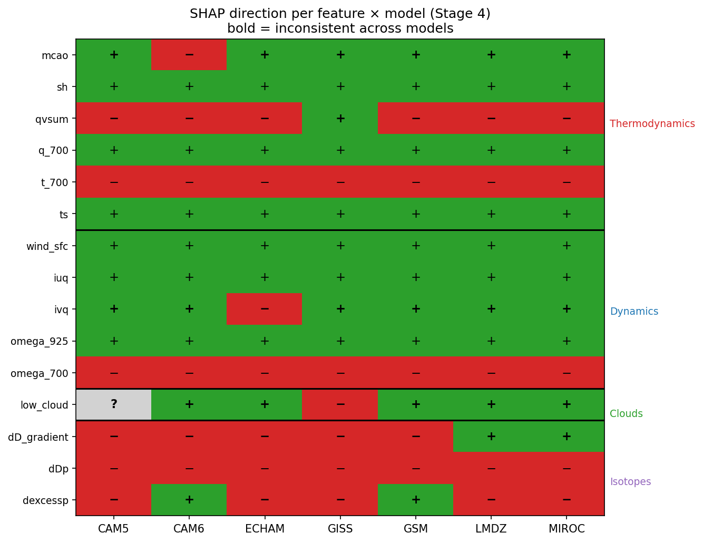

# SHAP Analysis

## Beeswarm plots

Each figure shows one model across four staged predictor sets (Thermo -> +Dynamics -> +Clouds -> +Isotopes). Within each panel, features are ranked by mean |SHAP value| (most important at top). Each dot is one grid cell-month sample. The x-axis shows the SHAP value: how much that feature pushed the predicted PE above (positive) or below (negative) the model baseline. Dot color reflects the feature's value -- red = high, blue = low -- so a cluster of red dots on the right means high feature values increase PE, while red dots on the left mean high values decrease PE. The R^2 in the title is the mean out-of-sample test score across 25 random splits.

### CAM5

### CAM6

### ECHAM

### GISS

### GSM

### LMDZ

### MIROC

---

## Group-level PE attribution via Shapley values

Each bar shows the fraction of Stage 4 R2 attributed to each predictor group (thermodynamics, dynamics, clouds, isotopes) for one model. Attributions are computed using the group Shapley value (Shapley 1953; Jullum et al. 2021): each group's value is its average marginal R2 contribution over all 4! orderings of the groups, computed exactly by training XGBoost on each of the 2^4 = 16 possible group coalitions. Hyperparameters are tuned separately per coalition. Values are averaged over 5 random seeds; bars sum to the Stage 4 R2 by the efficiency axiom. Note that the Stage 4 R2 values here are estimated from 5 seeds and may differ slightly from the 25-seed estimates in the beeswarm plots above.

The heatmap below shows each group's Shapley value as a fraction of Stage 4 R2, with the dominant group per model highlighted.

Thermodynamics is the dominant predictor group in all seven models, accounting for 39–68% of Stage 4 R2. This is consistent across models despite substantial differences in absolute R2 (0.65–0.78) and in the relative contributions of dynamics, clouds, and isotopes.

| Model | Dominant group | Fraction | Stage 4 R2 |
|-------|---------------|----------|------------|
| CAM5  | Thermodynamics | 0.548 | 0.650 |
| CAM6  | Thermodynamics | 0.681 | 0.686 |
| ECHAM | Thermodynamics | 0.387 | 0.657 |
| GISS  | Thermodynamics | 0.547 | 0.642 |
| GSM   | Thermodynamics | 0.441 | 0.777 |
| LMDZ  | Thermodynamics | 0.455 | 0.648 |
| MIROC | Thermodynamics | 0.560 | 0.723 |

### Sensitivity: dDp excluded from isotope group

To test whether the backward feature dDp (precipitation isotope ratio, which is co-determined with PE) drives the isotope group attribution, we re-ran the group Shapley computation with dDp removed, retaining only dD_gradient and dexcessp. If the isotope Shapley value drops substantially without dDp, it suggests dDp was carrying variance that is mechanistically circular. The table below compares isotope group Shapley values with and without dDp, alongside the full-coalition Stage 4 R2 for the no-dDp run.

| Model | Isotopes (full) | Isotopes (no dDp) | Delta | Stage 4 R2 (no dDp) |
|-------|-----------------|-------------------|-------|----------------------|
| CAM5  | 0.119 ± 0.006   | 0.043 ± 0.003     | −0.076 | 0.627               |
| CAM6  | 0.114 ± 0.005   | 0.089 ± 0.005     | −0.025 | 0.676               |
| ECHAM | 0.150 ± 0.004   | 0.086 ± 0.002     | −0.064 | 0.618               |
| GISS  | 0.160 ± 0.005   | 0.101 ± 0.007     | −0.059 | 0.617               |
| GSM   | 0.182 ± 0.007   | 0.121 ± 0.006     | −0.061 | 0.748               |
| LMDZ  | 0.117 ± 0.003   | 0.058 ± 0.001     | −0.059 | 0.627               |
| MIROC | 0.114 ± 0.004   | 0.077 ± 0.003     | −0.037 | 0.721               |

Removing dDp reduces the isotope Shapley value by 0.025–0.076 across models (median −0.059), confirming that dDp carries a meaningful share of the isotope group's marginal R2. However, even without dDp the isotope group retains a positive attribution (0.043–0.121) in every model, indicating that dD_gradient and dexcessp provide independent predictive signal beyond what thermodynamics, dynamics, and clouds capture. The reduction in Stage 4 R2 (full minus no-dDp, implied by the group Shapley sums) is consistent with dDp contributing real variance, though the physical interpretation of that contribution warrants caution.

### Forward model: Stage 4 with dDp excluded

As a complementary test, we trained the full Stage 4 XGBoost model (25 seeds, same CV design) with dDp removed and compared test R2 to the full Stage 4 model. A small delta confirms that dDp is not the primary driver of the Stage 4 predictions.

| Model | Stage 4 R2 | No-dDp R2 | Delta |
|-------|------------|-----------|-------|
| CAM5  | 0.646      | 0.624     | −0.021 |
| CAM6  | 0.680      | 0.674     | −0.006 |
| ECHAM | 0.649      | 0.617     | −0.031 |
| GISS  | 0.639      | 0.617     | −0.022 |
| GSM   | 0.774      | 0.751     | −0.023 |
| LMDZ  | 0.645      | 0.625     | −0.020 |
| MIROC | 0.719      | 0.713     | −0.006 |

The median R2 drop is 0.021, ranging from 0.006 (CAM6, MIROC) to 0.031 (ECHAM). This is modest relative to the full Stage 4 R2 (0.64–0.77), suggesting the model's predictive skill is not contingent on dDp. The residual isotope skill (from dD_gradient and dexcessp) is therefore not an artifact of circular reasoning through dDp.

---

## Isotope-only beeswarm plots

Each figure shows SHAP values for a model trained on only the three isotope predictors (dD_gradient, dDp, dexcessp). This isolates the standalone predictive skill of isotopes. The R2 in the title is the mean out-of-sample test score across 25 random splits. Across all models, isotope-only R2 is substantially larger than the marginal gain from adding isotopes to Stage 3, indicating that most of the isotope signal is shared with thermodynamics, dynamics, and clouds.

| Model | Isotope-only | Stage 3 | Stage 4 | Isotope contribution (staged model, Stage 4 - Stage 3) |
|-------|--------------|---------|---------|--------------------------------------------------------|
| CAM5  | 0.198        | 0.607   | 0.646   | 0.039                                                  |
| CAM6  | 0.217        | 0.669   | 0.680   | 0.011                                                  |
| ECHAM | 0.252        | 0.591   | 0.649   | 0.057                                                  |
| GISS  | 0.258        | 0.607   | 0.639   | 0.032                                                  |
| GSM   | 0.332        | 0.744   | 0.774   | 0.030                                                  |
| LMDZ  | 0.207        | 0.589   | 0.645   | 0.055                                                  |
| MIROC | 0.232        | 0.696   | 0.719   | 0.023                                                  |

### CAM5

### CAM6

### ECHAM

### GISS

### GSM

### LMDZ

### MIROC

---

## Intermodel feature importance heatmap (Stage 4)

Normalized mean |SHAP| per feature across all models.

---

## Within-group feature importance (Stage 4)

Mean |SHAP| per feature within each predictor group, broken out by model. Shows which variables are load-bearing vs. redundant within each group.

---

## Feature direction consistency across models (Stage 4)

For each feature, the sign of its SHAP effect on PE: + means high feature values increase PE, − means they decrease PE, ? means the direction could not be determined (too many NaN values). Direction is computed as the sign of the Spearman correlation between feature values and SHAP values. **Bold / NO*** indicates the direction is inconsistent across models.

| Feature | Group | CAM5 | CAM6 | ECHAM | GISS | GSM | LMDZ | MIROC | Consistent |
|---------|-------|------|------|-------|------|-----|------|-------|------------|
| mcao | thermo | + | − | + | + | + | + | + | NO * |
| sh | thermo | + | + | + | + | + | + | + | YES |
| qvsum | thermo | − | − | − | + | − | − | − | NO * |
| q_700 | thermo | + | + | + | + | + | + | + | YES |
| t_700 | thermo | − | − | − | − | − | − | − | YES |
| ts | thermo | + | + | + | + | + | + | + | YES |
| wind_sfc | dynamics | + | + | + | + | + | + | + | YES |
| iuq | dynamics | + | + | + | + | + | + | + | YES |
| ivq | dynamics | + | + | − | + | + | + | + | NO * |
| omega_925 | dynamics | + | + | + | + | + | + | + | YES |
| omega_700 | dynamics | − | − | − | − | − | − | − | YES |
| low_cloud | clouds | ? | + | + | − | + | + | + | NO * |
| dD_gradient | isotopes | − | − | − | − | − | + | + | NO * |
| dDp | isotopes | − | − | − | − | − | − | − | YES |
| dexcessp | isotopes | − | + | − | − | + | − | − | NO * |

Notable inconsistencies: mcao is negative in CAM6 only (opposite to all others); qvsum is positive in GISS only; dD_gradient flips sign in LMDZ and MIROC; dexcessp is inconsistent in 5 of 7 models. The universally negative direction of dDp (− in all 7 models) is consistent with dDp acting as a proxy for heavy precipitation events, which dilute PE.

---

## MCAO SHAP dependence (colored by low cloud fraction)

Each figure shows one stage. Within each panel, the x-axis is the MCAO value and the y-axis is the SHAP value for MCAO -- i.e., how much MCAO alone shifted the predicted PE for that sample. Points above zero indicate MCAO increased PE; points below indicate it decreased PE. In Stages 3-4, dots are colored by low cloud fraction (red = high cloud, blue = low cloud), revealing how the MCAO-PE relationship is affected by cloud cover. Stages 1-2 are shown in gray since low cloud is not yet included as a predictor. Axes are shared across models within each stage to allow direct comparison.

### Stage 1: Thermo

### Stage 2: + Dynamics

### Stage 3: + Clouds

### Stage 4: + Isotopes

