# WisoMIP

## Climatological Maps

| MCAO                   | PE                   |
|------------------------|----------------------|
| 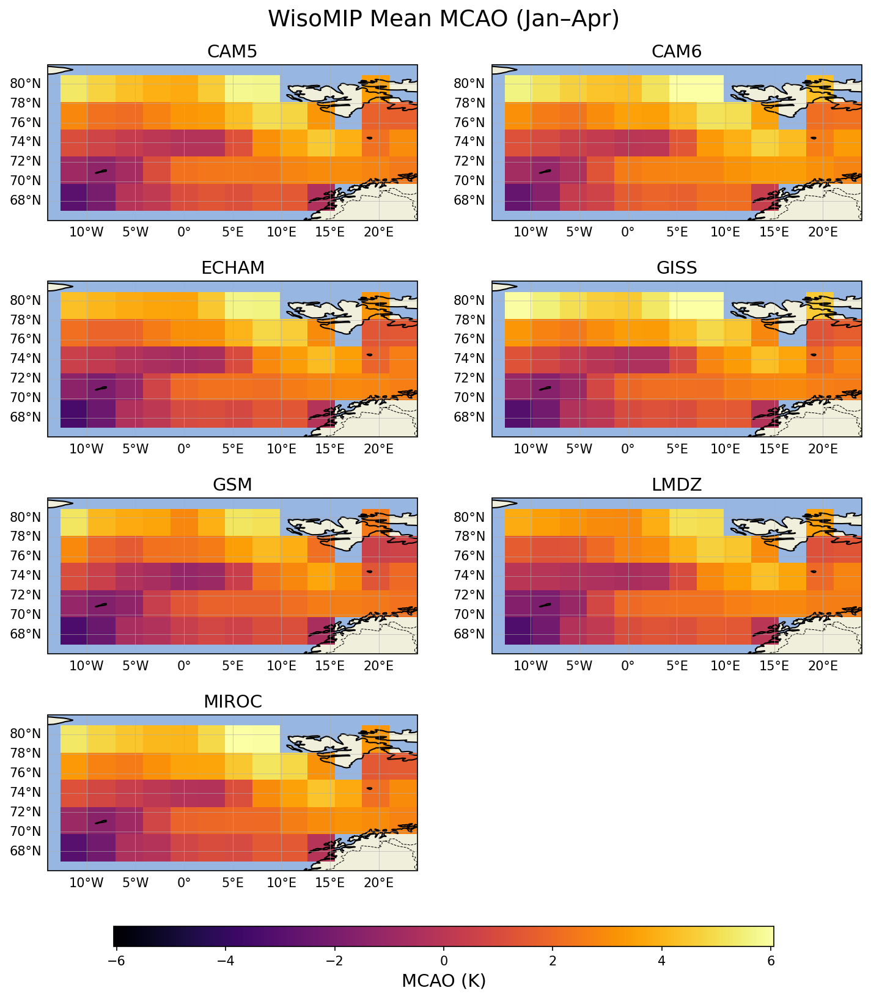 | 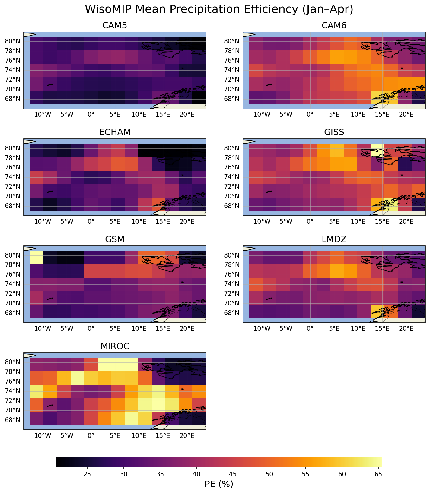 |

## PE vs MCAO Hexbin by Model

PE truncated at 100% (values > 100% excluded).

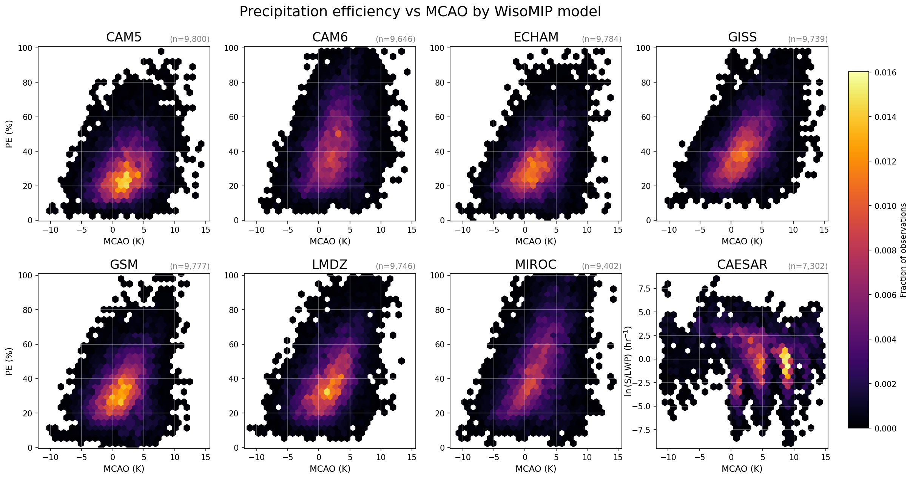

## Distributions by Model
PE truncated at 100% (values > 100% excluded).
The x-axis is limited to between the first and 99th percentiles of all observations.

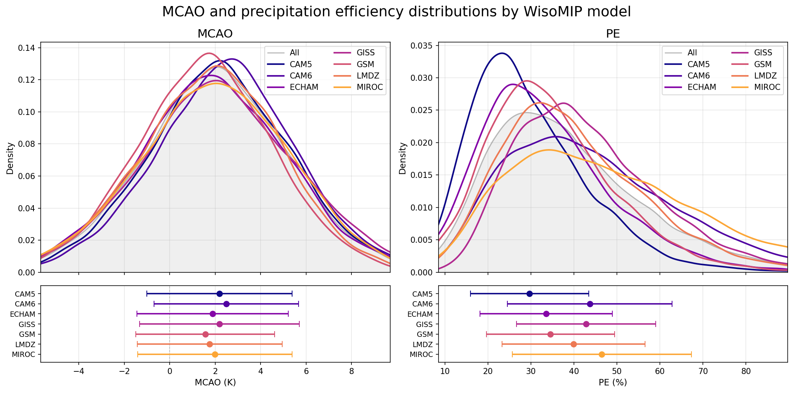

## PE vs MCAO Colored by Overlay Fields

All plots below use PE <= 100% only.

### Isotopes

| dD precipitation (median) | d-excess precipitation (median) |
|--|--|
| 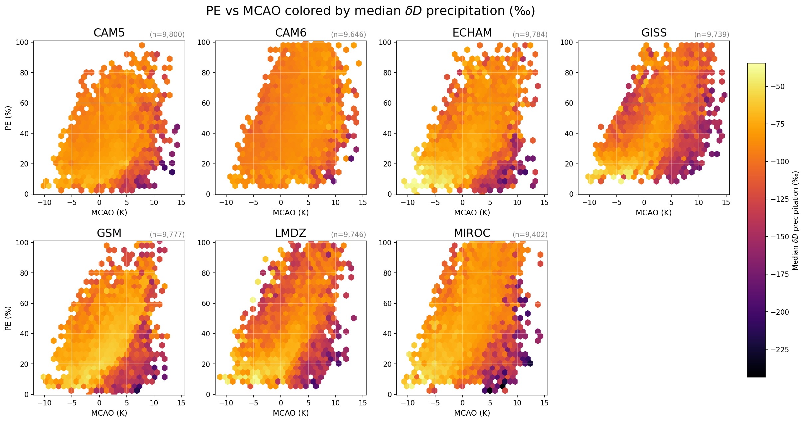 | 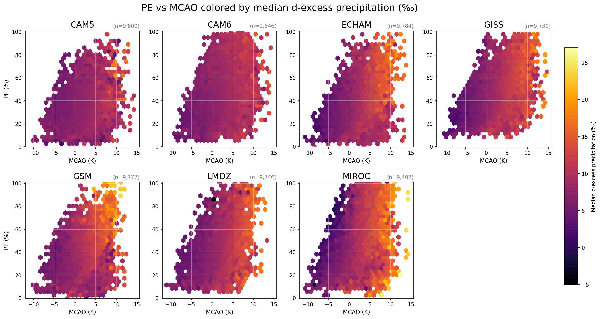 |

| dD vapor 600-800 hPa (mean) | dD vapor 800-925 hPa (mean) |
|--|--|
| 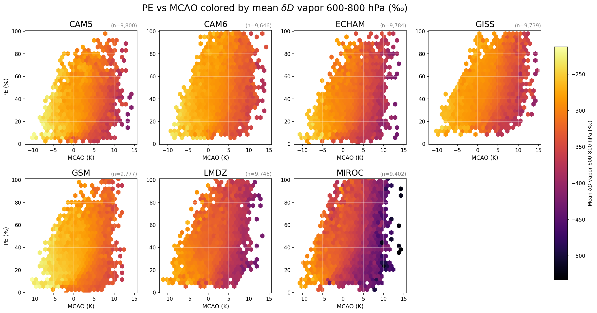 | 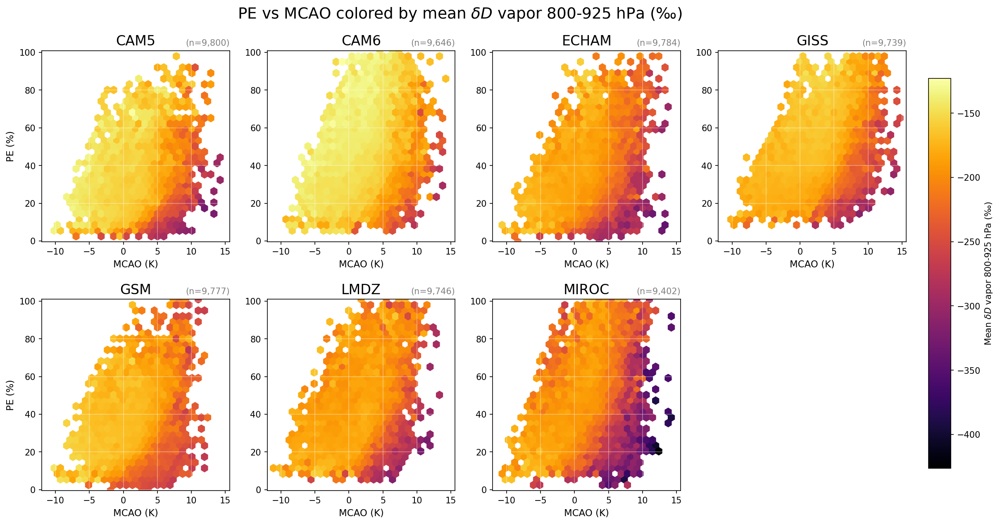 |

### Surface Fields

For pr/ev: grid cells with evaporation <= 0 are excluded before computing the ratio, so that we can take the natural log (for better color definition).

| Specific humidity (median) | Precipitation rate (mean) |
|--|--|
| 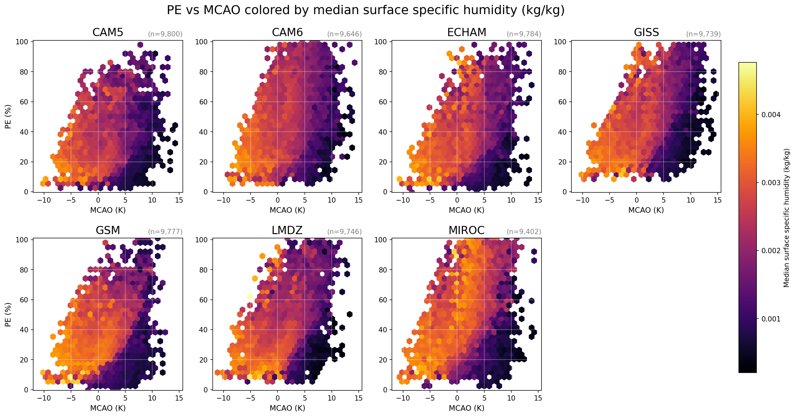 | 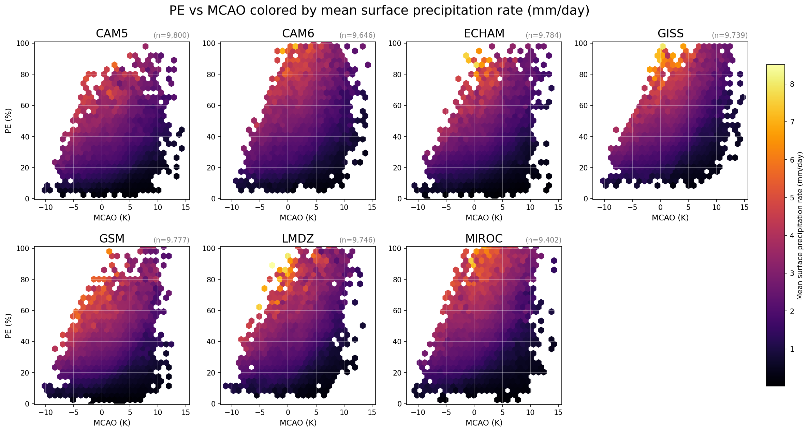 |

| Evaporation rate (mean) | ln(precipitation/evaporation) (mean) |
|--|--|
| 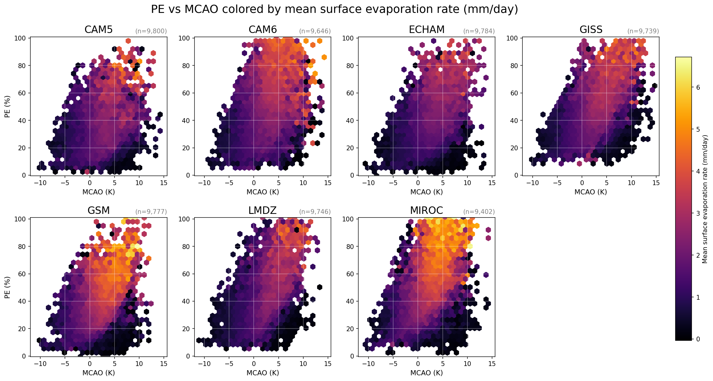 | 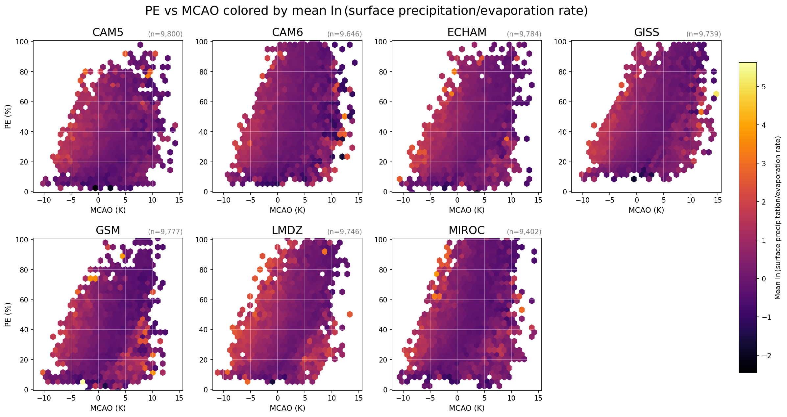 |
