# SHAP Analysis of Precipitation Efficiency

We used XGBoost gradient-boosted trees to reconstruct precipitation efficiency (PE) from atmospheric state variables in seven WisoMIP models -- CAM5, CAM6, ECHAM, GISS, GSM, LMDZ, and MIROC -- over the CAESAR region (66-82N, 14W-24E) for the JFMA season, 1979-2021. SHAP (SHapley Additive exPlanations) values were computed for each predictor to attribute model skill to individual variables and predictor groups. The analysis proceeds through six linked questions: (1) can we reconstruct PE from atmospheric state variables at all, and which predictors are most important visually? (2) which predictor groups drive the bulk of PE predictability, accounting for correlations among features? (3) do isotope predictors contribute real, non-circular signal? (4) which specific variables drive PE and are their effects physically consistent across models? (5) what is the minimum feature set needed for near-optimal reconstruction? (6) do the learned relationships generalize forward in time?

**Note on attribution vs. causation.** High SHAP importance means the XGBoost model found that feature useful -- not that it physically causes PE to change. Features correlated with the true causal driver receive positive attributions even if downstream; this distinction applies throughout.

---

## 1. Reconstructing PE from Atmospheric State Variables

### Methodology

Can atmospheric state variables reconstruct PE, and which predictor groups account for most of the variance?

We trained four separate XGBoost models, each on a cumulative predictor set that adds one group to the previous stage. The ordering -- thermodynamics first, isotopes last -- reflects a prior that large-scale thermodynamic and dynamic state should explain the bulk of PE variance, with clouds and isotopes entering as secondary refinements; this ordering is also the natural sequence of observational availability. The four stages and their features are:

- **Stage 1 -- Thermodynamics (6 features):** MCAO (marine cold-air outbreak index, defined as SST minus 850 hPa potential temperature), surface specific humidity (sh), column water vapor (qvsum), 700 hPa specific humidity (q\_700), 700 hPa temperature (t\_700), surface temperature (ts)
- **Stage 2 -- +Dynamics (4 features):** wind speed magnitude at 925 hPa (wind\_sfc), vertically integrated moisture transport magnitude (ivt), 925 hPa vertical velocity (omega\_925), 700 hPa vertical velocity (omega\_700)
- **Stage 3 -- +Clouds (1 feature):** low cloud fraction (low\_cloud)
- **Stage 4 -- +Isotopes (5 features):** dD vertical gradient (dD\_gradient, computed as mean dD over 800-600 hPa minus mean dD over 925-800 hPa), dD of precipitation (dDp), d-excess of precipitation (dexcessp), dD of surface vapor (dDs), d-excess of surface vapor (dexcesss)

CAM5 lacks cloud diagnostics in the model output and so skips Stage 3; its sequence is Stages 1, 2, 4. Samples with PE outside [0, 100] are excluded as unphysical before training.

Model performance was estimated using 5-fold cross-validation with spatial grouping: CV folds are split by month-year (e.g., all grid cells from January 1979 in the same fold) rather than by grid cell, so that spatial autocorrelation within a single month cannot inflate held-out scores. We report R^2 (fraction of PE variance explained) as the skill metric: it is scale-free, which allows direct comparison across models whose PE distributions differ in spread, and it is the additive scalar required by the group Shapley efficiency axiom in Section 2. Results are averaged over 10 random seeds; the R^2 shown in each figure title is the mean out-of-sample score across those seeds.

### Results

Reconstruction skill grows monotonically with added predictor groups; the largest gain is Stage 1->2 (+Dynamics). Stage 4 R^2 values (0.66-0.80 across models) are at or above expectation for a statistical reconstruction of PE. The scatter plots show a consistent tendency to underpredict high PE and overpredict low PE -- the predicted range is narrower than the simulated range. This is present across all models and stages and is expected: any regression model predicts conditional means, which have less spread than the true distribution.

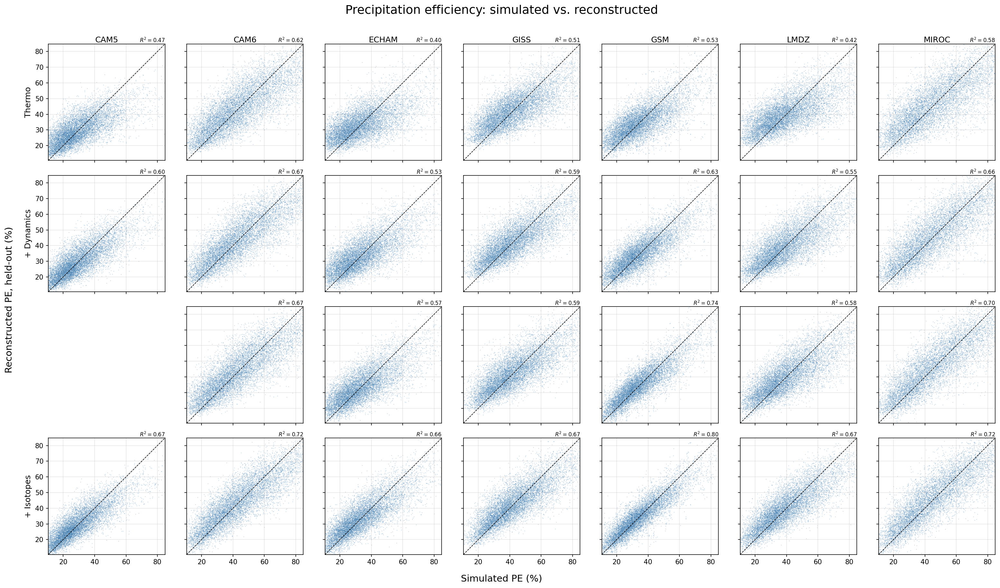

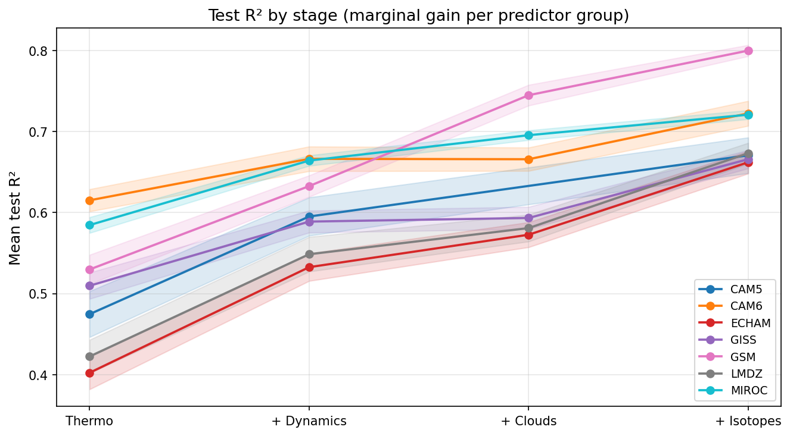

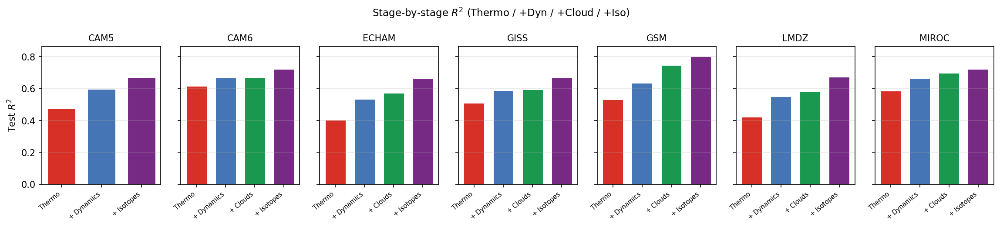

MCAO rank varies by model, suggesting model-specific sensitivity.

#### CAM5
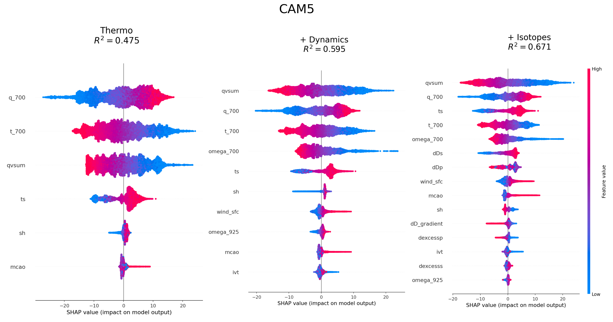

#### CAM6
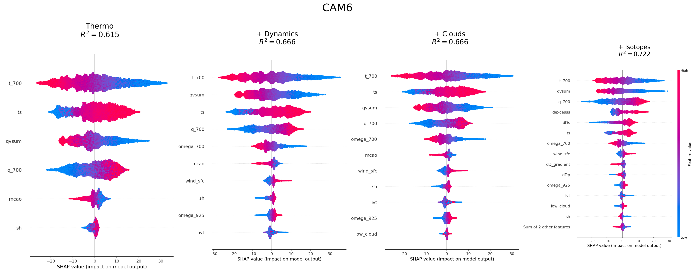

#### ECHAM
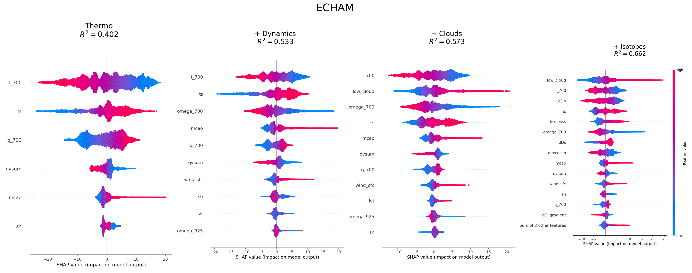

#### GISS
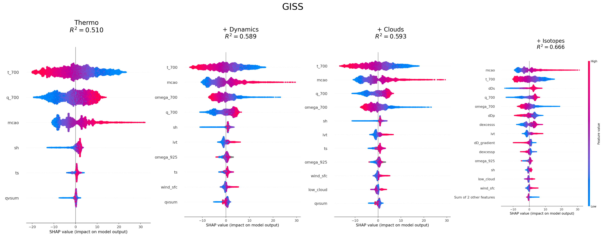

#### GSM
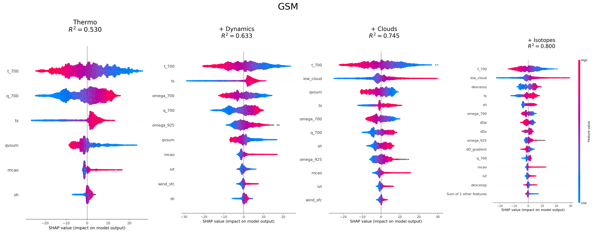

#### LMDZ
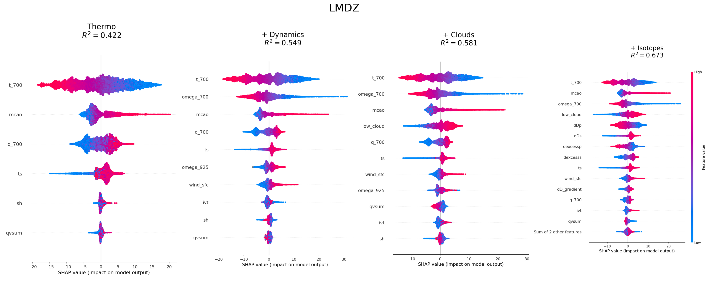

#### MIROC
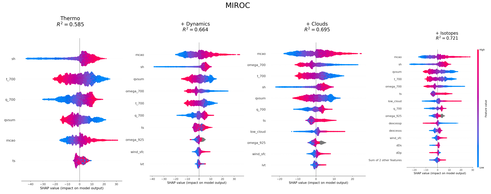

### Spatial Residuals (Stage 4)

Time-mean (actual - predicted) PE at each grid cell over 1979-2021 JFMA. Coherent spatial structure would indicate regions where the feature set systematically misses the relevant processes; a near-white map indicates errors are not geographically structured. Residuals are small and mostly spatially unstructured across models; ECHAM shows the most within-model spatial variation, but no pattern is consistent across all seven models.

**FIXME:** regenerate -- longitude labels currently overlap between panels.
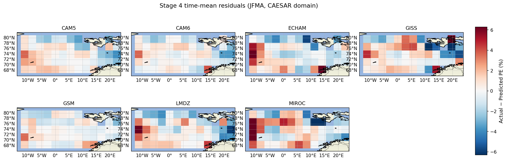

---

## 2. Predictor Group Attribution via Shapley Decomposition

Individual feature SHAP values are unreliable when predictors within a group are correlated -- summing them double-counts shared variance. We need a method that attributes PE predictability to groups while averaging out the order in which groups enter the model.

### Methodology

We used the group Shapley value (Shapley 1953; Jullum et al. 2021), which treats each predictor group as a single player in a cooperative game. Each group's attribution is its average marginal R^2 contribution over all possible orderings of the four groups. Averaging over all orderings removes the dependence on group-entry order -- the key weakness of staged decompositions.

Concretely, this requires training XGBoost on each of the 2^4 = 16 possible group coalitions and computing the R^2 for each. Hyperparameters are tuned separately for each coalition -- using Stage 4 hyperparameters for a 3-feature isotope-only coalition would give an unfair disadvantage to small coalitions. Each coalition is evaluated over 10 random seeds. The group Shapley values satisfy the efficiency axiom: their sum equals the Stage 4 R^2 (verified empirically for all 7 models). Because the group Shapley and staged analyses are independent runs, Stage 4 R^2 estimates here may differ slightly from the beeswarm panel titles.

### Results

The stacked bar chart shows each group's Shapley attribution per model; bar height equals Stage 4 R^2 (efficiency axiom). The fraction heatmap normalizes within each model so rows sum to 1.0, making it easier to compare relative group contributions across models with different absolute R^2.

Thermodynamics is the dominant predictor group in six of seven models; ECHAM is the exception, where isotopes and thermodynamics are tied at 0.33. The isotope group's Shapley attribution is substantially larger than its staged marginal gain -- the collinearity correction: most of the PE information in isotope features is shared with thermodynamics and dynamics, and the staged design awards isotopes only the residual after those groups have already entered the model. Group Shapley, by averaging over all orderings, gives isotopes credit for their standalone contribution as well as their marginal one.

Clouds show the widest inter-model variation: near-zero attribution in some models versus strongly positive attribution in others. This is a continuous inter-model spread, not a binary split, and may reflect genuine differences in how cloud radiative effects and cloud-precipitation feedbacks are parameterized across models.

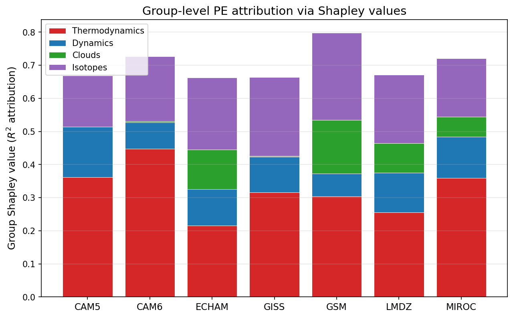

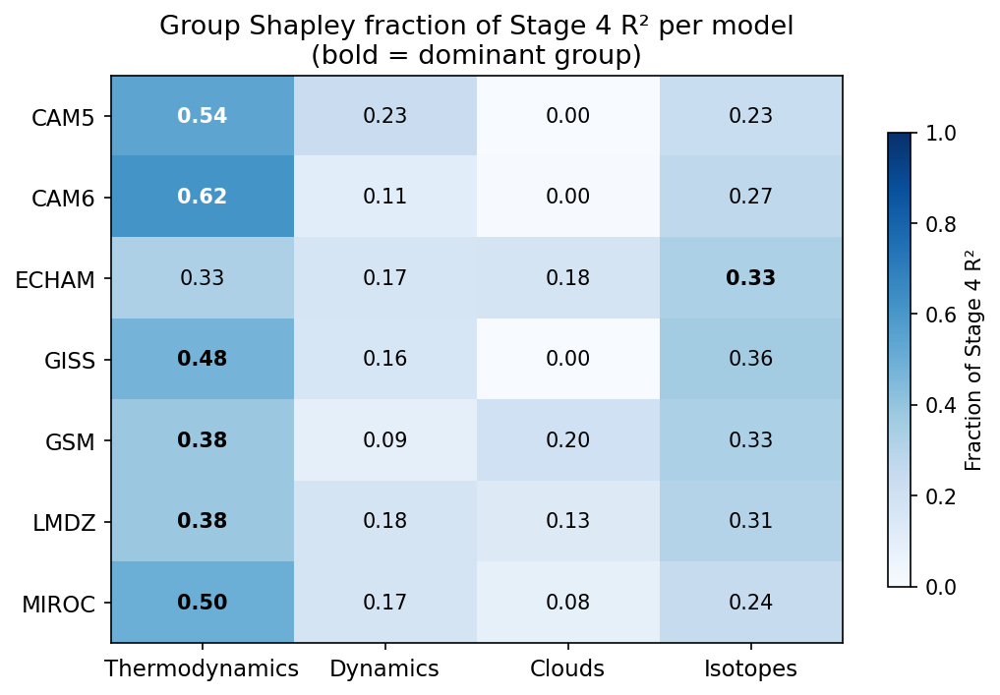

| Model | Thermo fraction | Stage 4 R^2 |
|-------|-----------------|------------|
| CAM5  | 0.541 | 0.669 |
| CAM6  | 0.616 | 0.727 |
| ECHAM | 0.325 | 0.663 |
| GISS  | 0.477 | 0.663 |
| GSM   | 0.381 | 0.798 |
| LMDZ  | 0.380 | 0.671 |
| MIROC | 0.499 | 0.720 |

---

## 3. The Role of Isotope Predictors

The group Shapley analysis shows that isotopes carry real predictive signal (see Section 2 table). However, one of the five isotope features -- dD of precipitation (dDp) -- is potentially circular: PE and dDp are both outputs of the same precipitation event, so dDp may be a diagnostic of PE rather than an independent atmospheric predictor. The following three sub-analyses examine whether isotope attribution survives after removing this concern, how much standalone PE information isotopes contain, and which isotope variable is load-bearing.

### 3.1 Circularity Test: Removing dDp

#### Methodology

We ran two complementary tests to assess whether the isotope group's attribution is driven by dDp's circular co-determination with PE.

*Group Shapley sensitivity*: Re-ran the full 16-coalition group Shapley computation with dDp excluded from the isotope group, retaining dD_gradient, dexcessp, dDs, and dexcesss. If the isotope Shapley value drops substantially, dDp was carrying variance that reflects circularity rather than independent atmospheric information.

*Forward model without dDp*: Retrained the full Stage 4 XGBoost model on 15 features (dDp removed) using the same 10-seed CV protocol. A small R^2 drop confirms that the model's predictive skill is not contingent on dDp.

#### Results

The first table below compares the isotope group's Shapley value with and without dDp (from the group Shapley sensitivity test). The Delta column quantifies how much of the isotope attribution is driven by dDp; a positive residual in the "no dDp" column confirms that the remaining isotope features carry independent signal. The second table compares the full Stage 4 forward model R^2 against a 15-feature retrain with dDp removed; the Delta column shows the cost of eliminating the circular feature.

| Model | Isotopes (full) | Isotopes (no dDp) | Delta | Stage 4 R^2 (no dDp) |
|-------|-----------------|-------------------|-------|----------------------|
| CAM5  | 0.155 +- 0.010   | 0.080 +- 0.009     | -0.075 | 0.635               |
| CAM6  | 0.197 +- 0.010   | 0.171 +- 0.010     | -0.026 | 0.719               |
| ECHAM | 0.218 +- 0.006   | 0.154 +- 0.005     | -0.064 | 0.618               |
| GISS  | 0.238 +- 0.008   | 0.195 +- 0.006     | -0.043 | 0.643               |
| GSM   | 0.263 +- 0.006   | 0.244 +- 0.005     | -0.019 | 0.790               |
| LMDZ  | 0.206 +- 0.005   | 0.155 +- 0.006     | -0.051 | 0.646               |
| MIROC | 0.176 +- 0.005   | 0.171 +- 0.005     | -0.005 | 0.724               |

| Model | Stage 4 R^2 | No-dDp R^2 | Delta |
|-------|------------|-----------|-------|
| CAM5  | 0.671      | 0.636     | -0.035 |
| CAM6  | 0.722      | 0.716     | -0.006 |
| ECHAM | 0.662      | 0.621     | -0.041 |
| GISS  | 0.666      | 0.641     | -0.025 |
| GSM   | 0.800      | 0.790     | -0.010 |
| LMDZ  | 0.673      | 0.647     | -0.026 |
| MIROC | 0.721      | 0.718     | -0.003 |

*Note: the "Stage 4 R^2 (no dDp)" column in Table 1 and the "No-dDp R^2" column in Table 2 are not identical quantities. Table 1 estimates come from the group Shapley sensitivity re-run (hyperparameters tuned per coalition); Table 2 estimates come from a direct forward model retrain (hyperparameters tuned once on the 15-feature set). Small differences between the two are expected.*

### 3.2 Isotope Standalone Predictive Skill

#### Methodology

Group Shapley quantifies each group's average marginal contribution, but it does not directly show how much PE information isotopes contain unconditionally -- i.e., if one had only isotopic observations. We trained XGBoost on all five isotope predictors (dD_gradient, dDp, dexcessp, dDs, dexcesss), using the same 5-fold grouped CV and 10 seeds. Comparing the isotope-only R^2 to the staged marginal (Stage 4 - Stage 3) reveals how much isotope PE information is genuinely independent vs. shared with the non-isotope groups.

#### Results

| Model | Isotope-only | Stage 3 | Stage 4 | Isotope marginal |
|-------|--------------|---------|---------|-----------------|
| CAM5  | 0.245        | --       | 0.671   | 0.076\*         |
| CAM6  | 0.328        | 0.666   | 0.722   | 0.056           |
| ECHAM | 0.361        | 0.573   | 0.662   | 0.089           |
| GISS  | 0.399        | 0.593   | 0.666   | 0.073           |
| GSM   | 0.488        | 0.745   | 0.800   | 0.055           |
| LMDZ  | 0.335        | 0.581   | 0.673   | 0.092           |
| MIROC | 0.351        | 0.695   | 0.721   | 0.026           |

\*CAM5 has no Stage 3 (cloud diagnostics absent); marginal computed as Stage 4 - Stage 2.

Beeswarm plots for the isotope-only model:

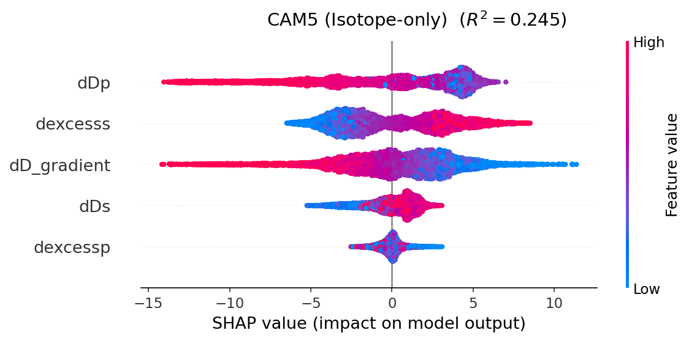
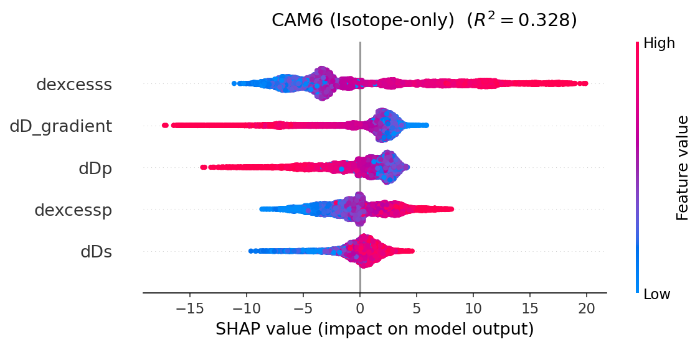
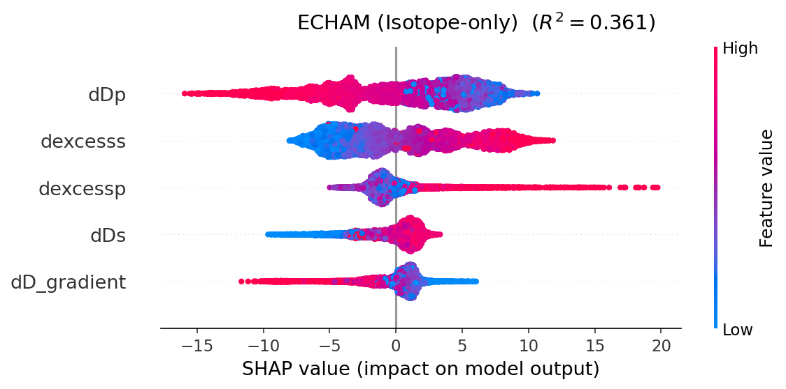
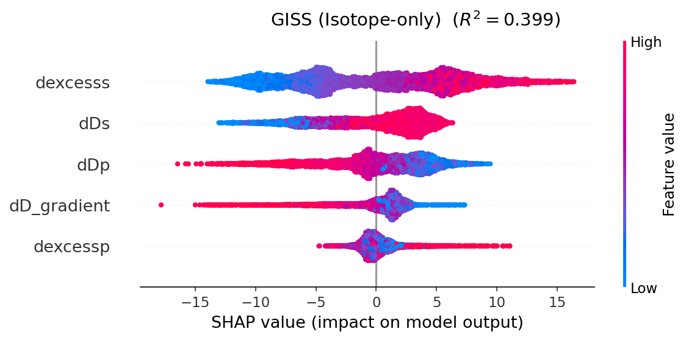
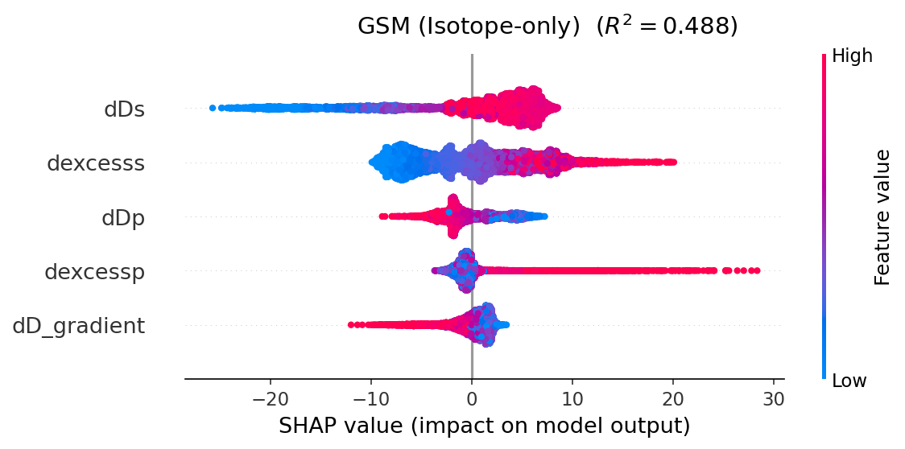
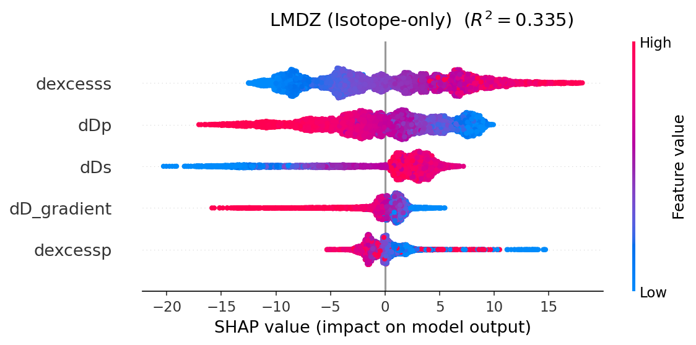
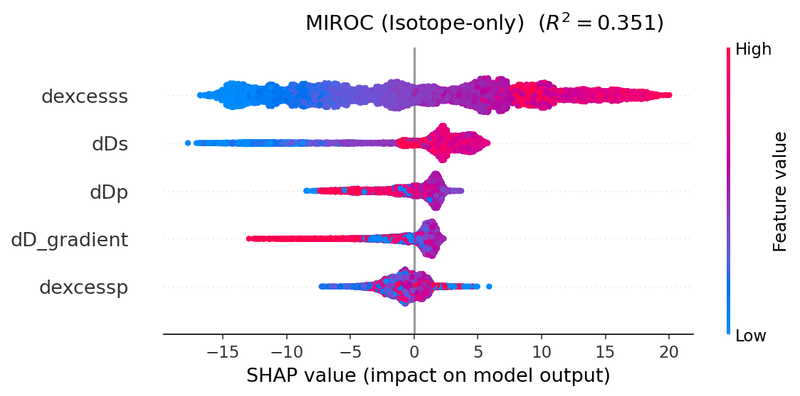

### 3.3 Within-Isotope Attribution

#### Methodology

To decompose the isotope-only R^2 into per-feature contributions while respecting the correlations among isotope variables, we applied group Shapley at the sub-group level: each of five isotope variables is treated as a separate player. The five variables are the same as those used in Stage 4 and the isotope-only model: dD\_gradient, dDp, dexcessp, dDs, and dexcesss. All 2^5 = 32 coalitions are evaluated, with hyperparameters tuned once on the full five-feature isotope set. Values are averaged over 10 seeds and sum to the isotope-only R^2 (efficiency axiom).

#### Results

The stacked bar chart below decomposes the isotope-only R^2 into per-variable contributions. This directly answers which isotope feature carries the signal identified in Section 3.2 and provides context for interpreting the dDp circularity concern from Section 3.1.

Stacked bars sum to the isotope-only R^2 (not Stage 4 R^2); the five segments correspond to the five isotope variables from the methodology above.

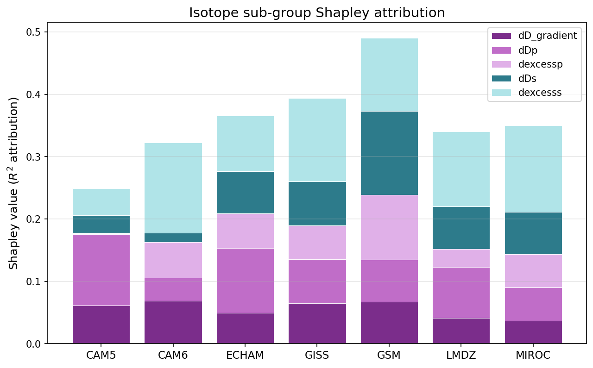

---

## 4. Feature-Level Diagnostics (Stage 4)

The group-level picture from Section 2 establishes which predictor categories matter, but leaves open which *specific variables* within each group are load-bearing, whether their effects are redundant across groups, and whether the direction of each feature's effect is physically consistent across models or model-specific.

### 4.1 Within-Group Importance and Intermodel Consistency

#### Methodology

For each feature in the Stage 4 model, we computed the mean absolute SHAP value, which measures the average magnitude of that feature's contribution to PE predictions across all samples. The intermodel heatmap normalizes these values within each model to show relative importance; the within-group plot breaks out the load-bearing variable within each predictor group separately, making it easier to see which variables carry the group's attribution.

#### Results

The heatmap reveals which features are universally important vs. model-specific; the within-group plot identifies the dominant variable within each group -- e.g., whether ts or t_700 is the primary thermodynamic driver, or whether ivt or wind_sfc carries the dynamics signal.

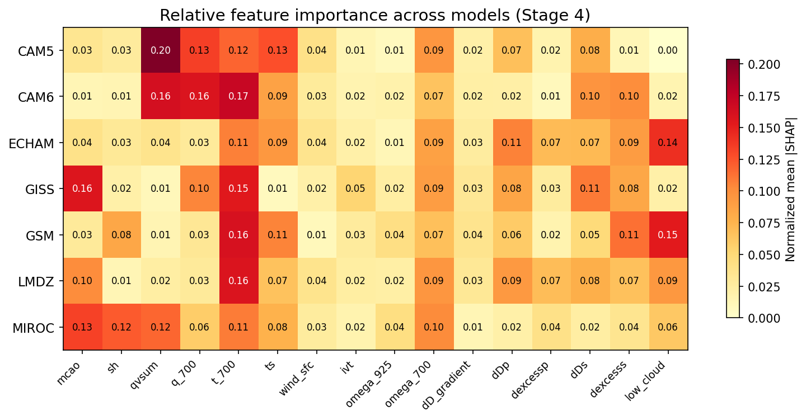

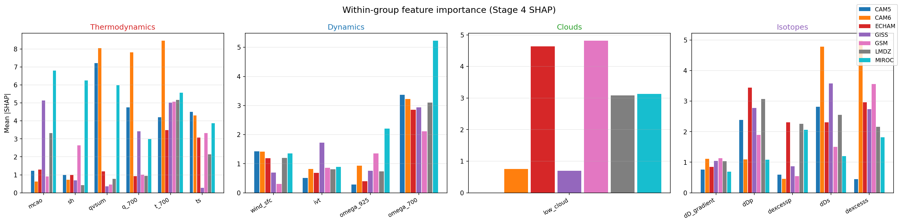

### 4.2 Feature Direction Consistency

#### Methodology

For each feature and model, we computed the sign of the Spearman correlation between feature values and SHAP values. A positive sign means high values of that feature tend to increase PE; negative means they decrease it. Consistent sign across all 7 models indicates a universal physical mechanism; inconsistent sign indicates a model-specific effect (see the preamble note on attribution vs. causation).

#### Results

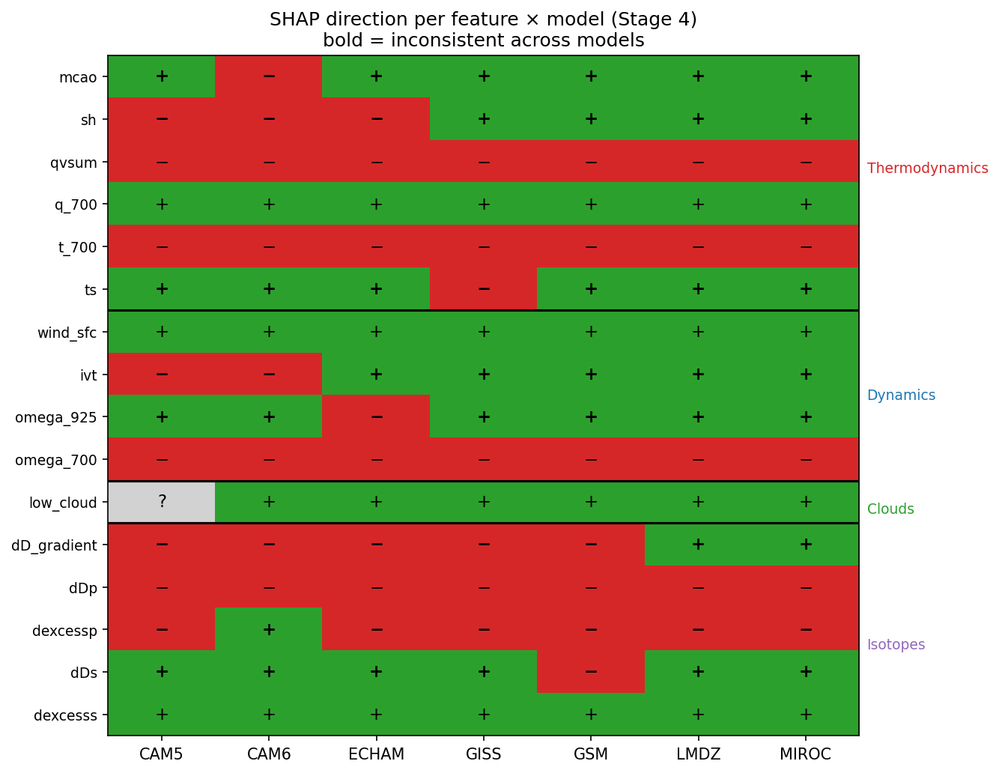

The consistent directions are physically interpretable throughout: warmer, moister conditions (ts, sh, q_700) increase PE; a colder free troposphere (t_700) and descending motion at 700 hPa (omega_700) increase PE, consistent with reduced convective ventilation of low-level moisture; low-level convergence (wind_sfc, ivt, omega_925) increases PE, consistent with enhanced moisture supply.

Bold-outlined cells (inconsistent direction) are worth examining closely: some features shift sign across models, suggesting a model-specific rather than universal physical mechanism. The isotope features show the widest direction inconsistency; the negative direction of dDp in most models is consistent with dDp acting as a proxy for heavy precipitation events, which produce isotopically depleted precipitation while simultaneously diluting PE.

### 4.3 MCAO-Cloud Cover Interaction

#### Methodology

MCAO is the most prominently inconsistent feature in the direction analysis above. Because cloud cover spans the widest attribution range across models, we examined whether the MCAO-PE relationship is modulated by cloud regime. We used SHAP dependence plots: for each sample, the x-axis shows its MCAO value and the y-axis shows SHAP(MCAO) -- how much MCAO alone shifted that sample's predicted PE. In Stages 3 and 4 (where low cloud is an active predictor), dots are colored by low cloud fraction to reveal any regime-dependent effect. Stages 1 and 2 are shown in gray. Axes are shared across models within each stage for direct comparison.

#### Stage 1: Thermo
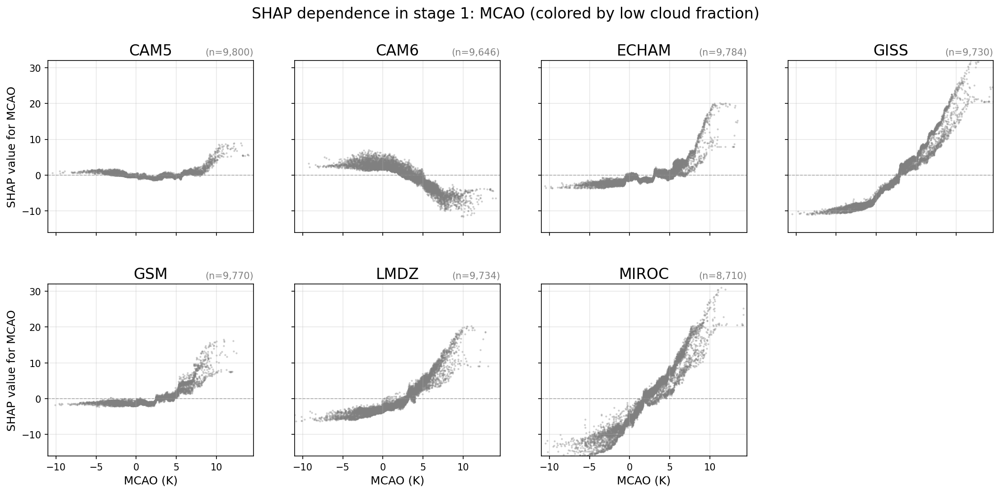

#### Stage 2: + Dynamics
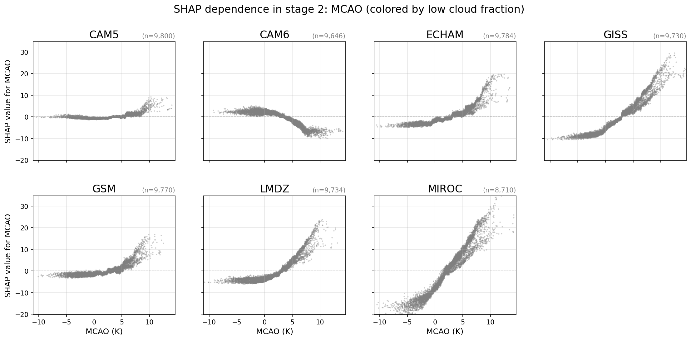

#### Stage 3: + Clouds
**FIXME:** regenerate -- CAM5 placeholder panel missing; current plot drops CAM5 entirely instead of leaving an empty slot.
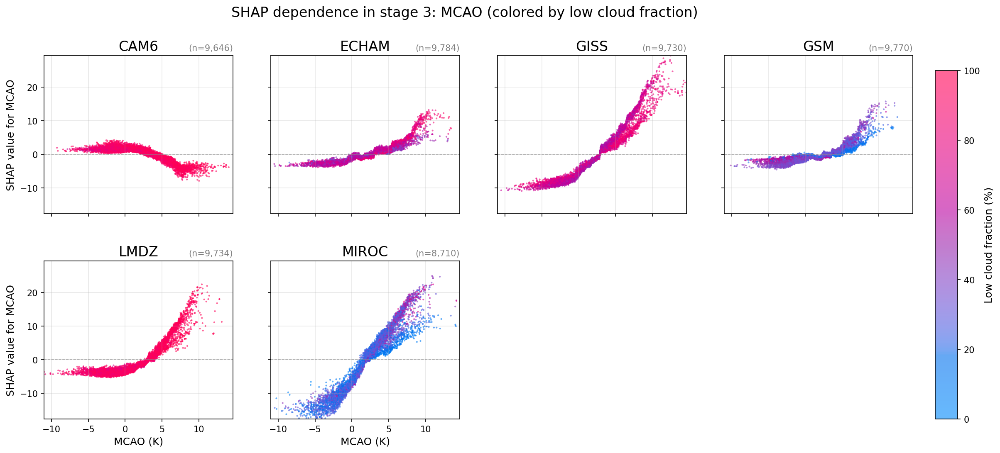

#### Stage 4: + Isotopes
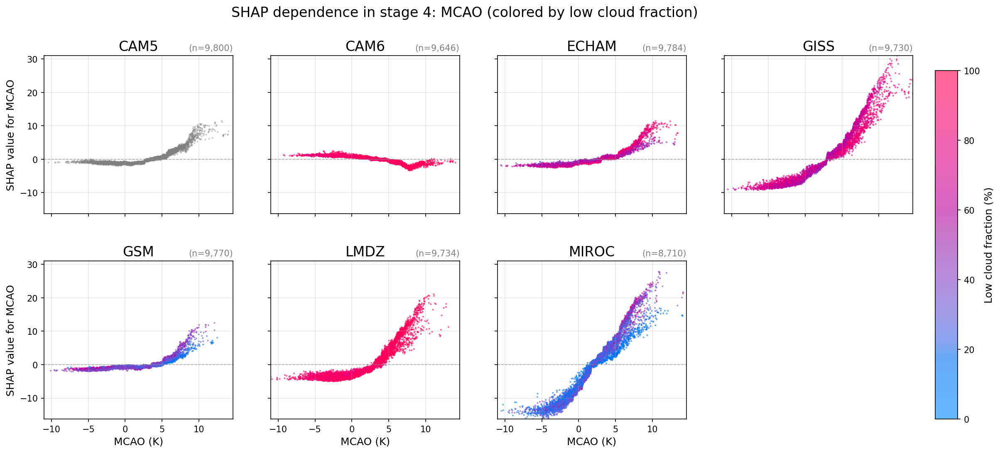

---

## 5. Minimum Feature Set for Near-Optimal PE Reconstruction

The feature-level diagnostics in Section 4 show that many variables partially overlap in their PE information -- correlated predictors like ts, t_700, and MCAO all encode aspects of marine instability. This raises the practical question: which variables are truly necessary vs. redundant, and could we achieve near-optimal PE reconstruction with a smaller, observationally accessible subset?

### Methodology

We used stability-based greedy forward feature selection to identify the minimum set of variables needed to achieve >=95% of the full-model R^2. At each step, the feature that most improves R^2 is selected. A critical design choice: hyperparameters are re-tuned on the current selected set at each step rather than carried over from the previous step. Without this, a new feature can appear important partly because the hyperparameters happened to be tuned with it in mind -- a form of tuning-luck bias that would inflate the apparent importance of late-entering features.

To avoid a second bias -- winner's-curse inflation of the R^2 curve -- we used a two-phase protocol. The first phase fixes the selection order; the second phase independently re-evaluates each prefix on fresh seeds that were not used during selection. This ensures the reported R^2 curve reflects true generalization, not selection-phase optimism.

The 95% threshold is a practical design choice -- 90% accepts too large a skill loss; 99% retains nearly all features.

*Note: an earlier version of this analysis also evaluated fixed subsets defined by data-source category (satellite-only, satellite + reanalysis). That comparison is not currently included.*

### Results

The R^2 vs. k curve shows how reconstruction skill grows as features are added in the greedy order. Features selected early and consistently across all 7 models are the physical backbone of PE reconstruction; features selected late are largely redundant given earlier predictors. Shaded bands show +-1 std across 10 independent evaluation seeds.

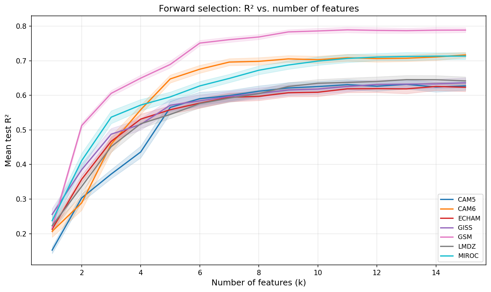

Green cells (low step number) mark features selected early and therefore most informative given prior selections; red cells mark features selected late, meaning they are largely redundant given the earlier-selected set. Gray cells indicate the feature is absent from that model.

**FIXME:** regenerate both plots -- `low_cloud` incorrectly appears for CAM5 (rank 13) rather than as a gray "absent" cell.
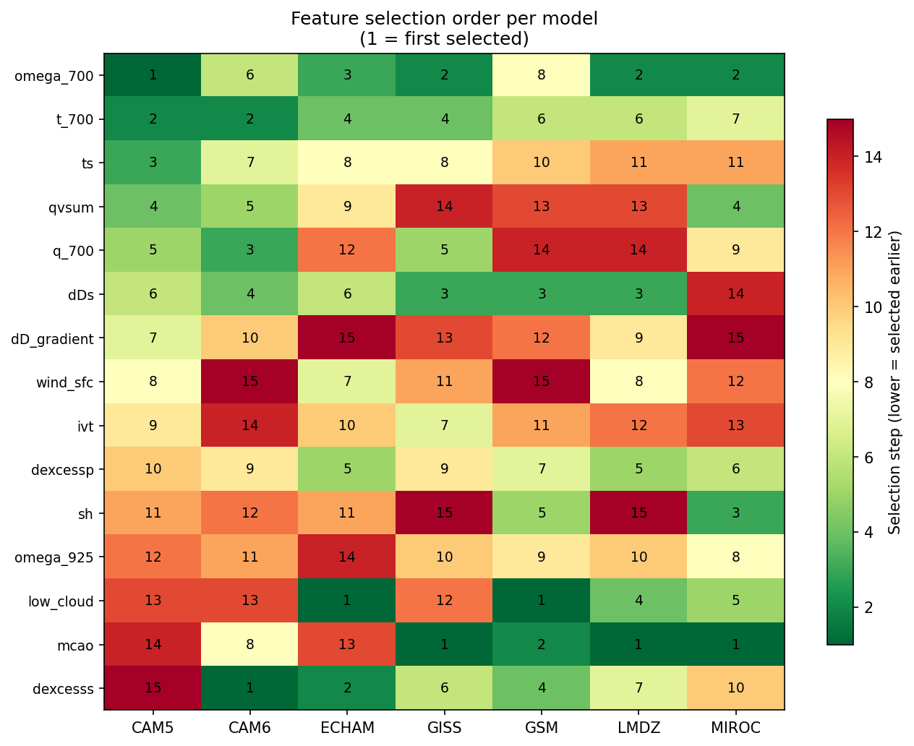

---

## 6. Out-of-Sample Temporal Prediction

The CV used in earlier sections shuffles month-years randomly across folds, so train and test sets draw from the same 1979-2021 climatological period. This tests spatial generalization but not temporal stability. Here we ask a harder question: do the learned PE-predictor relationships hold on years the model has never seen?

### Methodology

We split the data temporally: training on 1979-2012 (~80% of the full record, 34 years), testing on 2013-2021 (~20%, 9 years). The cutoff year is a practical choice to maximize training data while retaining a meaningful test window; it is not tied to a specific physical or forcing boundary. The test period is strictly held out -- no data from 2013 onward was used for training, hyperparameter tuning, or feature selection.

We used the forward-selected feature set from Section 5 at the 95% R^2 threshold. Hyperparameters were tuned on training data only, and predictions were averaged over 10 seeds.

*Note: an earlier version evaluated two scenarios separately (observable features only vs. all features including isotopes). That comparison is not currently included.*

### Results

The predicted vs. actual scatter and the residual-by-year boxplots together diagnose two things: (1) how well the model reconstructs PE in the 2013-2021 period, and (2) whether there is any systematic drift in residuals over time -- a sign the model is extrapolating beyond its training distribution.

#### Predicted vs. actual PE

Dots are colored by test year (dark purple = 2013, yellow = 2021). No systematic color clustering is visible in any model -- years are well-mixed throughout each scatter, indicating no temporal drift in bias. All models retain skill in the 0.60-0.75 range, close to their in-sample estimates from Section 1.

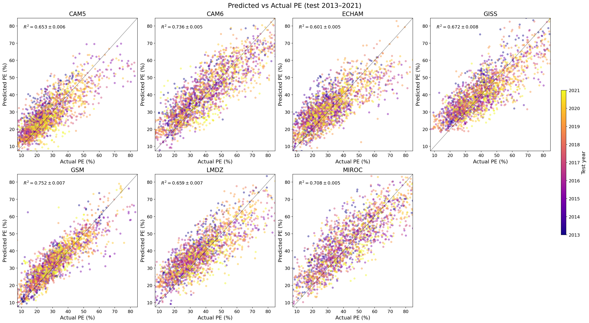

#### Residuals by year

The dashed red line at zero is the no-bias reference; each box spans the interquartile range of (actual - predicted) for that year. A rising or falling median across years indicates temporal drift in model bias.

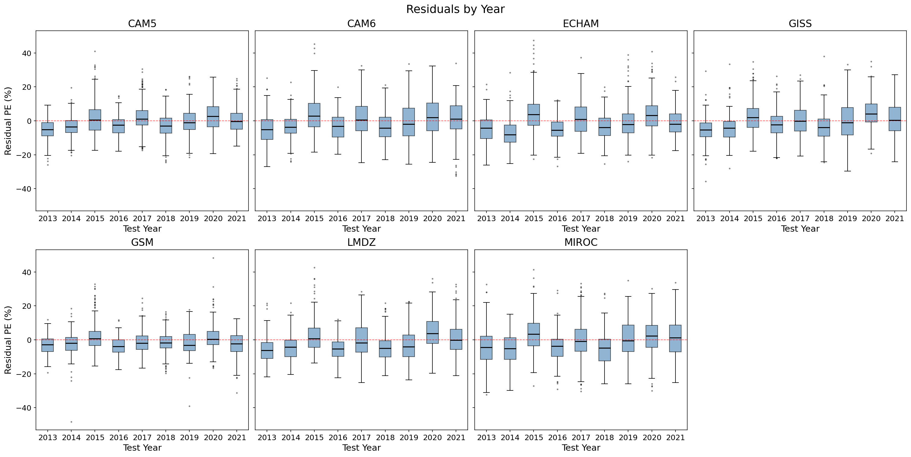

#### Spatial mean PE: actual vs. predicted

The maps below show the JFMA time-mean actual PE, predicted PE, and bias (actual - predicted) at each grid cell over the 2013-2021 test period. Systematic spatial structure in the bias indicates regions where the learned relationships do not generalize forward in time.

**FIXME:** regenerate -- bias panel sign was inverted (showed predicted-actual instead of actual-predicted).
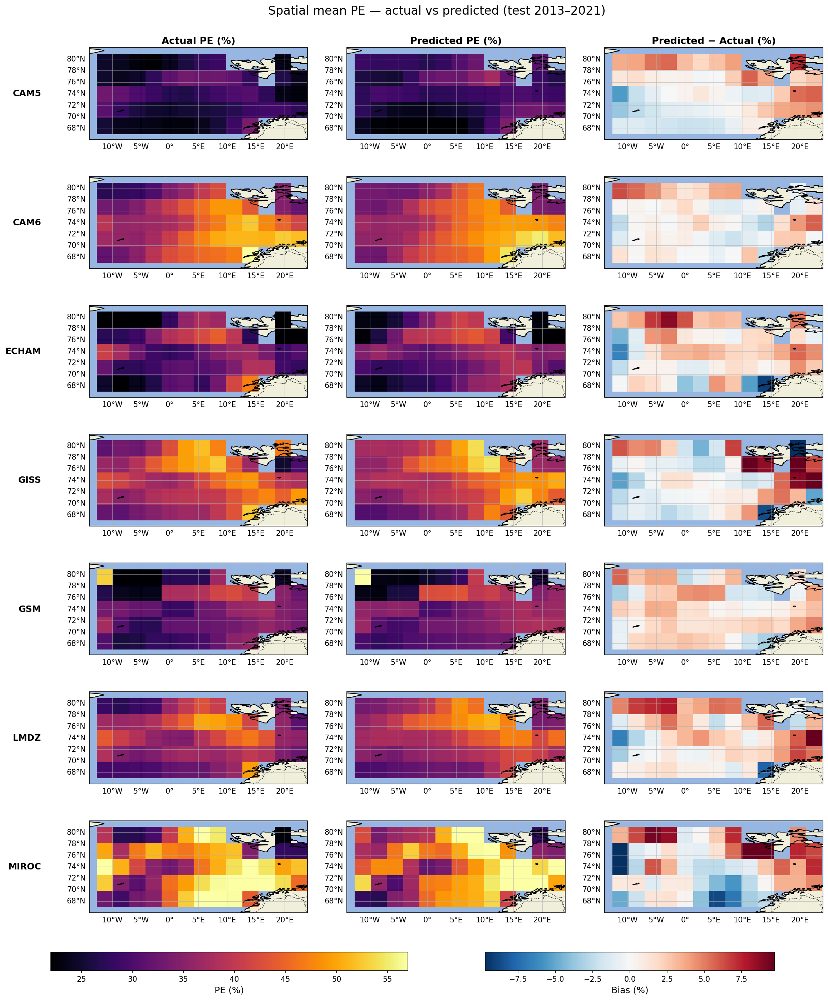
