# WisoMIP Swing3

## MCAO-PE Relationship

Exploratory characterization of how PE varies with the marine cold-air outbreak (MCAO) index across all models and overlaid atmospheric/isotope fields. These plots motivated the MCAO feature and the hexbin coloring approach used throughout the SHAP dependence plots.

### PE vs. MCAO by model

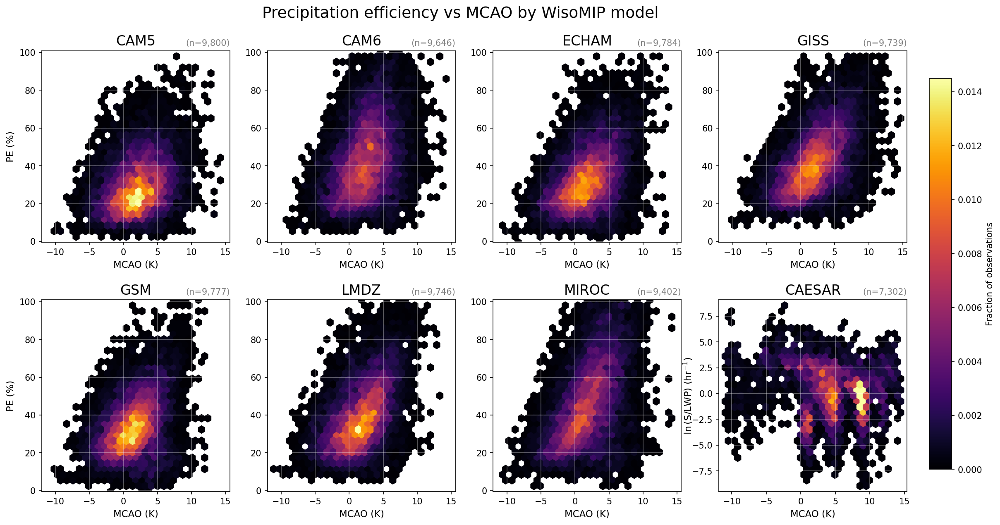

### PE distributions by model

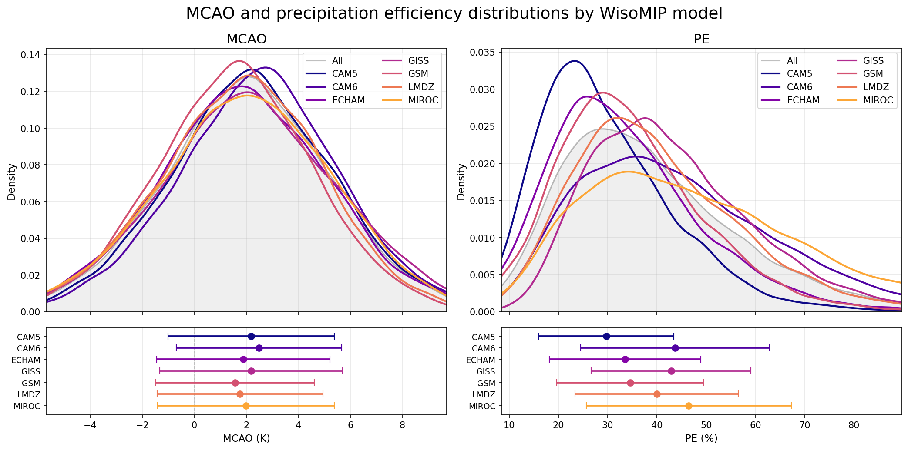

### Isotope overlays

| dD precipitation (median) | d-excess precipitation (median) |
|--|--|
| 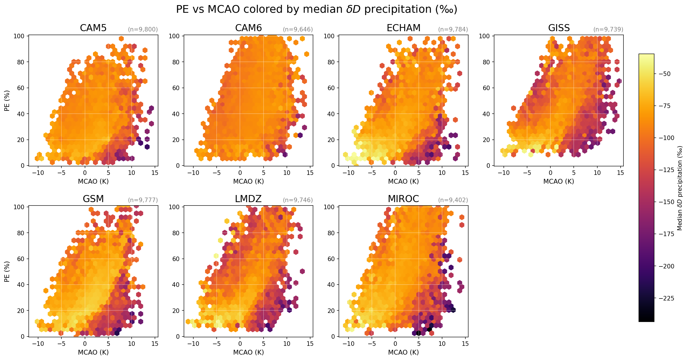 | 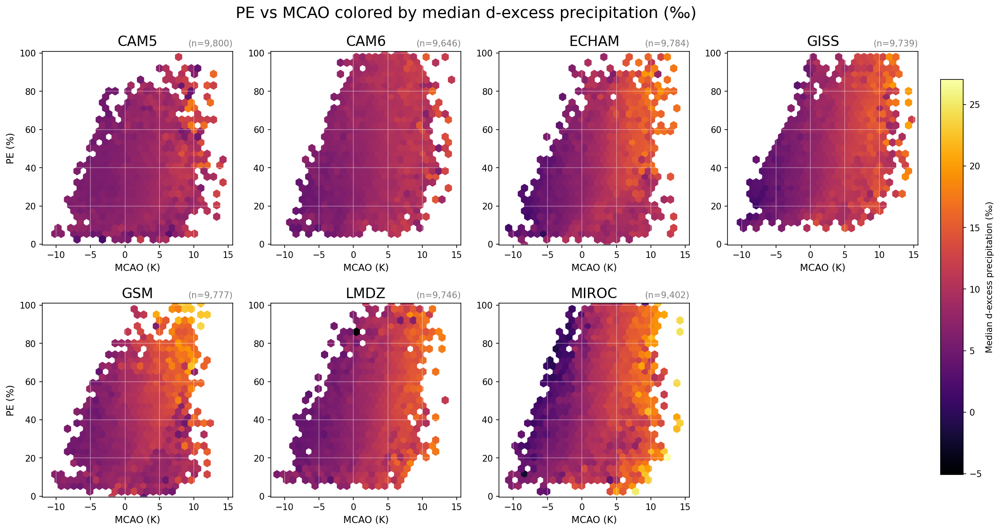 |

| dD vapor 800-925 hPa (mean) | dD vapor 600-800 hPa (mean) |
|--|--|
| 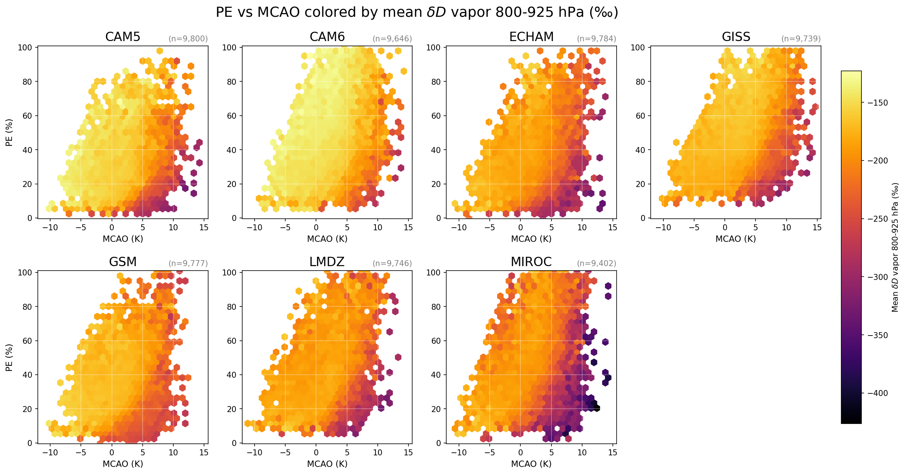 | 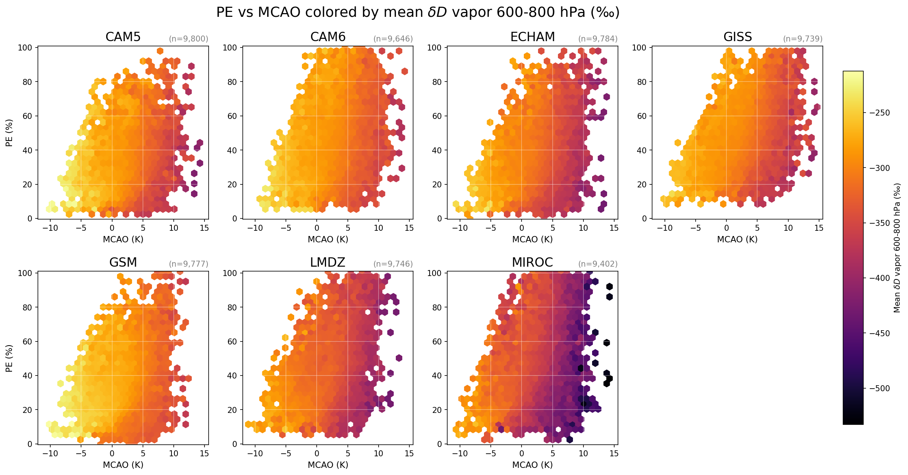 |

### Surface field overlays

Grid cells with evaporation ≤ 0 are excluded before computing ln(pr/ev).

| Specific humidity (median) | Precipitation rate (mean) |
|--|--|
| 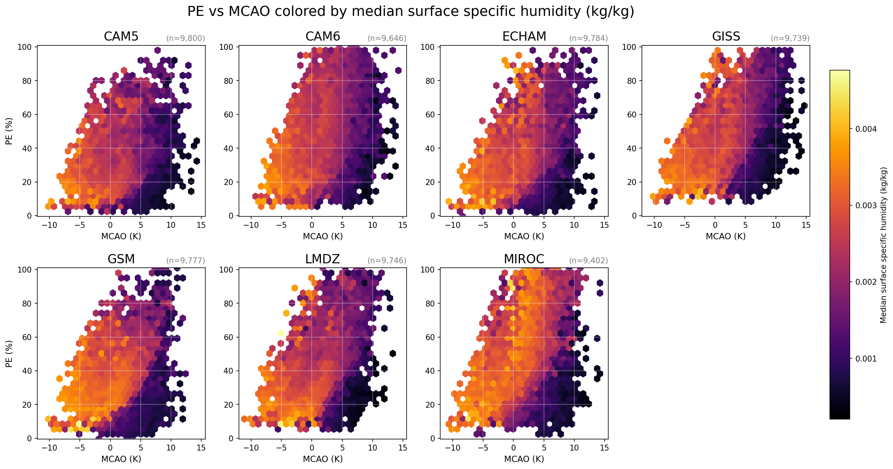 | 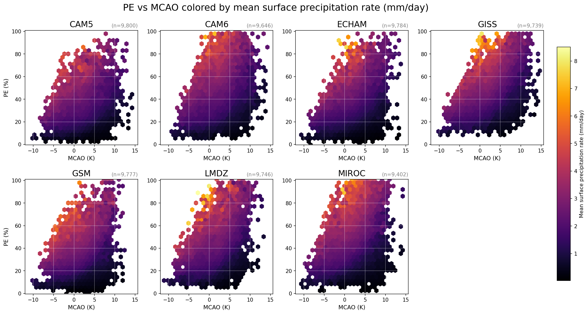 |

| Evaporation rate (mean) | ln(precipitation/evaporation) (mean) |
|--|--|
| 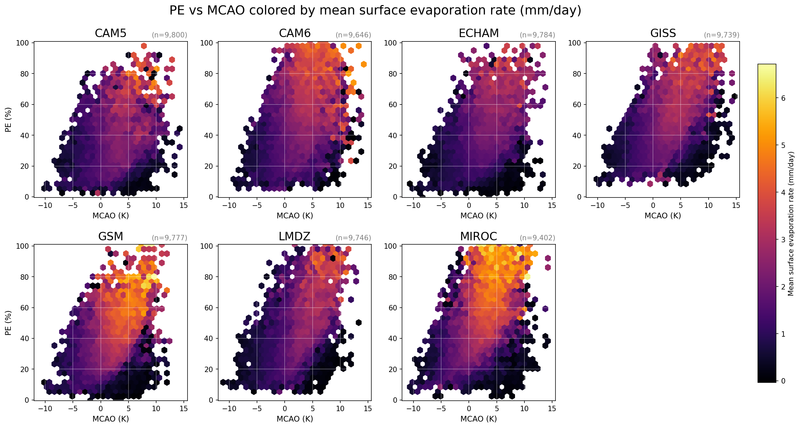 | 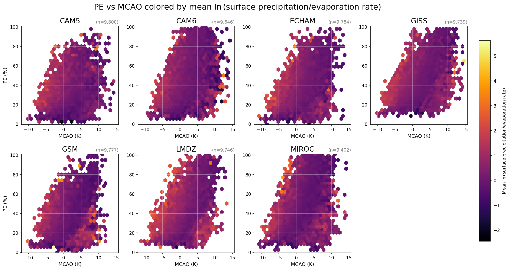 |

---

## Low Cloud Climatology

Time-mean JFMA low cloud fraction over the CAESAR region. The T42 panel shows the field regridded to a coarser resolution for cross-model comparison; the native-resolution panel preserves each model's original grid.

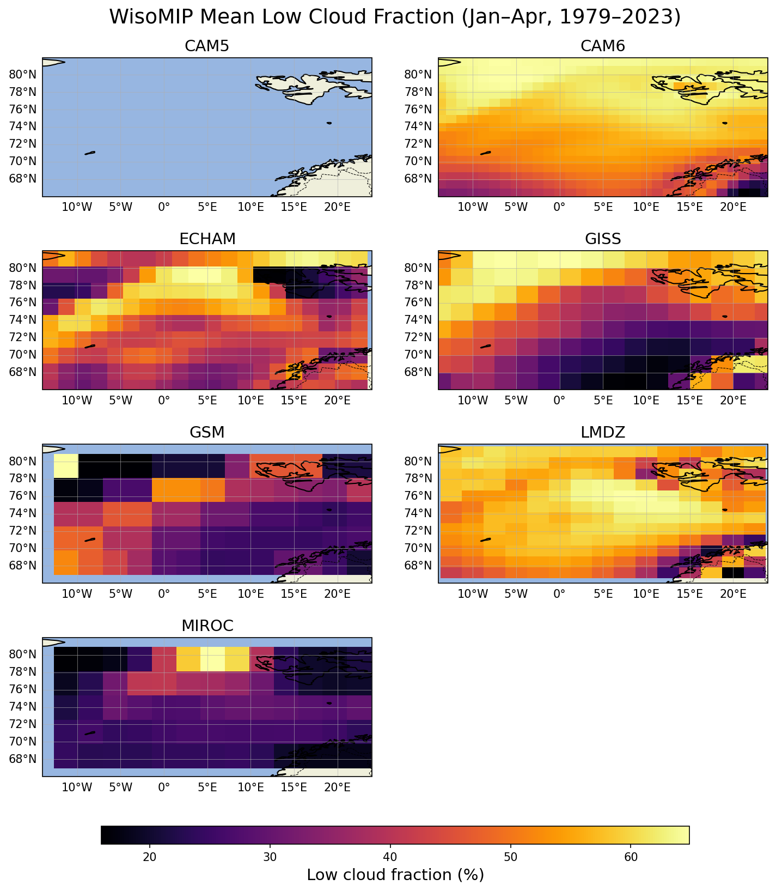

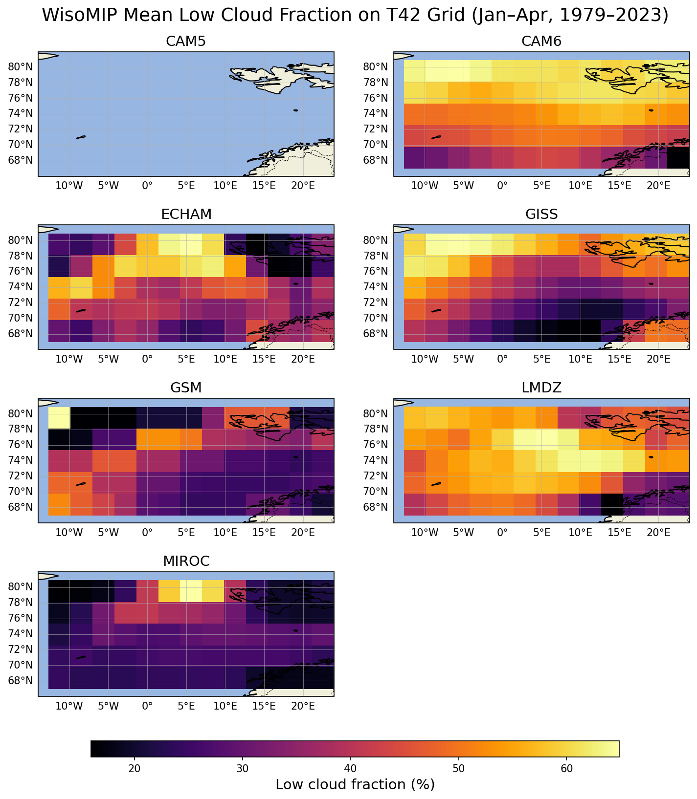
